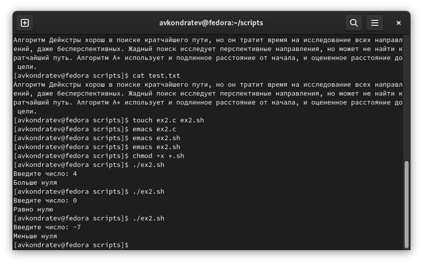
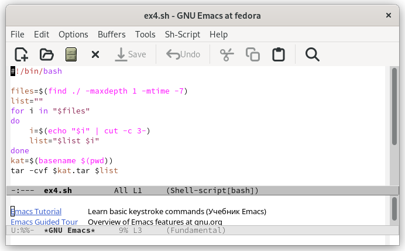

---
## Front matter
lang: ru-RU
title: "Лабораторная работа №11"
subtitle: "Дисциплина: Операционные системы"
author: Кондратьев Арсений Вячеславович
institute: Российский университет дружбы народов, Москва, Россия
date: 24.09.2022

## i18n babel
babel-lang: russian
babel-otherlangs: english

## Formatting pdf
toc: false
toc-title: Содержание
slide_level: 2
aspectratio: 169
section-titles: true
theme: metropolis
header-includes:
 - \metroset{progressbar=frametitle,sectionpage=progressbar,numbering=fraction}
 - '\makeatletter'
 - '\beamer@ignorenonframefalse'
 - '\makeatother'
---

# Цель работы

Изучить основы программирования в оболочке ОС UNIX. Научится писать более
сложные командные файлы с использованием логических управляющих конструкций
и циклов.

# Выполнение лабораторной работы

1.	Используя команды getopts grep, написать командный файл, который анализирует
командную строку с ключами, а затем ищет в указанном файле нужные строки, определяемые ключом -p

## Выполнение лабораторной работы

Написал скрипт(рис.[-@fig:001])(рис.[-@fig:002]) 

{ #fig:001 width=30% }

## Выполнение лабораторной работы

{ #fig:002 width=30% }
 
## Выполнение лабораторной работы
 
 В результате строка с искомым значением скопирована в отдельный файл(рис.[-@fig:003]) 
 
{ #fig:003 width=50% }
 
## Выполнение лабораторной работы

2. Написал на языке Си программу, которая вводит число и определяет, является ли оно больше нуля, меньше нуля или равно нулю. Затем программа завершается с помощью
функции exit(n), передавая информацию о коде завершения в оболочку. Командный файл вызывает эту программу и, проанализировав с помощью команды $?, выдает сообщение о том, какое число было введено

Написал код на С(рис.[-@fig:004])

{ #fig:004 width=30% }

## Выполнение лабораторной работы

Написал скрипт, который выводит результат в зависимости от переданной из программы информации(рис.[-@fig:005]) 

{ #fig:005 width=40% }
 
## Выполнение лабораторной работы
 
 В результате вводим число и нам сообщается, оно больше, меньше или равно нулю(рис.[-@fig:006]) 
 
 { #fig:006 width=50% }
 
## Выполнение лабораторной работы

3. Написал командный файл, создающий указанное число файлов, пронумерованных
последовательно от 1 до n, добавил поддержку удаления этих файлов

Написал скрипт, который в зависимости от опции создает либо удаляет файлы(рис.[-@fig:007])

{ #fig:007 width=40% }

## Выполнение лабораторной работы

В результате создали 3 файла с указанным расширением, а затем удалили их(рис.[-@fig:008])  

{ #fig:008 width=50% }
 
## Выполнение лабораторной работы

4. Написал командный файл, который с помощью команды tar запаковывает в архив
все файлы в указанной директории. Модифицировал его так, чтобы запаковывались
только те файлы, которые были изменены менее недели тому назад

Написал скрипт, в котором указал время последнего изменения менее недели, обрезал первые символы, чтобы в архиве не создавался каталог(рис.[-@fig:009])

{ #fig:009 width=40% }
 
## Выполнение лабораторной работы

В результате получили архив с файлами(рис.[-@fig:010]) 
 
{ #fig:010 width=50% }

# Вывод

Я изучил основы программирования в оболочке ОС UNIX. Научился писать более
сложные командные файлы с использованием логических управляющих конструкций
и циклов.

