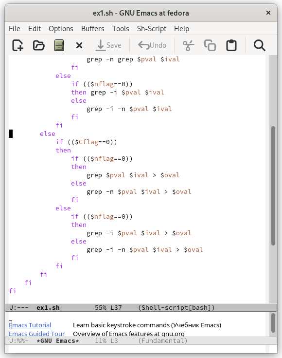
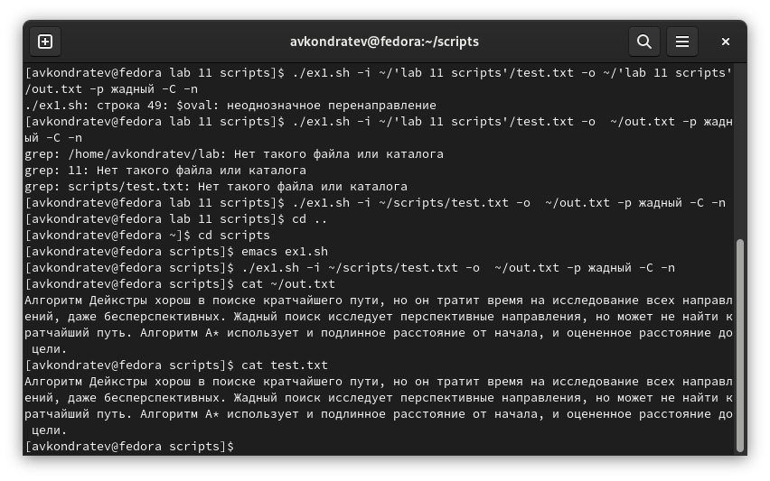

---
## Front matter
lang: ru-RU
title: "Лабораторная работа №11"
subtitle: "Дисциплина: Операционные системы"
author: "Кондратьев Арсений Вячеславович"
institute: "Российский университет дружбы народов, Москва, Россия"
date: 24.09.2022

## Generic otions
lang: ru-RU
toc-title: "Содержание"

## Bibliography
bibliography: bib/cite.bib
csl: pandoc/csl/gost-r-7-0-5-2008-numeric.csl

## Pdf output format
toc: true # Table of contents
toc-depth: 2

fontsize: 12pt
linestretch: 1.5
papersize: a4
documentclass: scrreprt
## I18n polyglossia
polyglossia-lang:
  name: russian
  options:
	- spelling=modern
	- babelshorthands=true
polyglossia-otherlangs:
  name: english
## I18n babel
babel-lang: russian
babel-otherlangs: english
## Fonts
mainfont: PT Serif
romanfont: PT Serif
sansfont: PT Sans
monofont: PT Mono
mainfontoptions: Ligatures=TeX
romanfontoptions: Ligatures=TeX
sansfontoptions: Ligatures=TeX,Scale=MatchLowercase
monofontoptions: Scale=MatchLowercase,Scale=0.9
## Biblatex
biblatex: true
biblio-style: "gost-numeric"
biblatexoptions:
  - parentracker=true
  - backend=biber
  - hyperref=auto
  - language=auto
  - autolang=other*
  - citestyle=gost-numeric


## Misc options
indent: true
header-includes:
  - \usepackage{indentfirst}
  - \usepackage{float} # keep figures where there are in the text
  - \floatplacement{figure}{H} # keep figures where there are in the text
---

# Цель работы

Изучить основы программирования в оболочке ОС UNIX. Научится писать более
сложные командные файлы с использованием логических управляющих конструкций
и циклов.

# Теоретическое введение

mark - присваивает значение строки символов

let - является показателем того, что последующие аргументы представляют собой выражение, подлежащее вычислению

break - прерывание циклов

# Выполнение лабораторной работы

1.	Используя команды getopts grep, написать командный файл, который анализирует
командную строку с ключами, а затем ищет в указанном файле нужные строки, определяемые ключом -p

Написал скрипт(рис.[-@fig:001])(рис.[-@fig:002])  
```bash
#!/bin/bash

iflag=0; oflag=0; pflag=0; Cflag=0; nflag=0;
while getopts i:o:p:C:n optletter
do case $optletter in
       i) iflag=1; ival=$OPTARG;;
	  o) oflag=1; oval=$OPTARG;;
	     p) pflag=1; pval=$OPTARG;;
		C) Cflag=1;;
		n) nflag=1;;
		*) echo Illegal option $optletter
   esac
done
if (($pflag==0))
then echo "Шаблон отсутствует"
else
    if (($iflag==0))
    then echo "Файл отсутствует"
    else
	if (($oflag==0))
	then
	    if ((Cflag==0))
	    then
		if ((nflag==0))
		then
		    grep $pval $ival
		else
		    grep -n grep $pval $ival
		fi
	    else
		if (($nflag==0))
		then grep -i $pval $ival
		else
		    grep -i -n $pval $ival
		fi
	    fi
	else
	    if (($Cflag==0))
	    then
		if (($nflag==0))
		then
		    grep $pval $ival > $oval
		else
		    grep -n $pval $ival > $oval
		fi
	    else
		if (($nflag==0))
		then
		    grep -i $pval $ival > $oval
		else
		    grep -i -n $pval $ival > $oval
		fi
	    fi
	fi
    fi
fi
```

{ #fig:001 width=70% }

{ #fig:002 width=70% }
 
  В результате строка с искомым значением скопирована в отдельный файл(рис.[-@fig:003]) 
 
{ #fig:003 width=70% }
 
2. Написал на языке Си программу, которая вводит число и определяет, является ли оно больше нуля, меньше нуля или равно нулю. Затем программа завершается с помощью
функции exit(n), передавая информацию о коде завершения в оболочку. Командный файл вызывает эту программу и, проанализировав с помощью команды $?, выдает сообщение о том, какое число было введено

Написал код на С(рис.[-@fig:004])  
```C
#include <stdio.h>
#include <stdlib.h>

int main(){
  printf("Введите число: ");
  int num;
  scanf("%d", &num);
  if (num>0) exit(0);
  if (num<0) exit(1);
  if (num==0) exit(2);
  return 0;
}
```
 
 { #fig:004 width=70% }
 
 Написал скрипт, который выводит результат в зависимости от переданной из программы информации(рис.[-@fig:005])  
```bash
 #!/bin/bash

gcc ex2.c -o ex2
./ex2
res=$?
case $res in
    0) echo "Больше нуля";;
    1) echo "Меньше нуля";;
    2) echo "Равно нулю";;
esac
```
 
 { #fig:005 width=70% }
 
  В результате вводим число и нам сообщается, оно больше, меньше или равно нулю(рис.[-@fig:006]) 
 
 { #fig:006 width=70% }
 
3. Написал командный файл, создающий указанное число файлов, пронумерованных
последовательно от 1 до n, добавил поддержку удаления этих файлов

Написал скрипт, который в зависимости от опции создает либо удаляет файлы(рис.[-@fig:007])  
```bash
#!/bin/bash

opt=$1;
format=$2;
num=$3;
for((i=1; i<=num; i++))
do
   file=$(echo $i$format)
   if [ $opt == "-r" ]
   then
       rm -f $file
   elif [ $opt == "-t" ]
   then
       touch $file
   fi
done
```

{ #fig:007 width=70% }

 В результате создали 3 файла с указанным расширением, а затем удалили их(рис.[-@fig:008])  

{ #fig:008 width=70% }
  
4. Написал командный файл, который с помощью команды tar запаковывает в архив
все файлы в указанной директории. Модифицировал его так, чтобы запаковывались
только те файлы, которые были изменены менее недели тому назад

Написал скрипт, в котором указал время последнего изменения менее недели, обрезал первые символы, чтобы в архиве не создавался каталог(рис.[-@fig:009])  
``` bash
#!/bin/bash

files=$(find ./ -maxdepth 1 -mtime -7)
list=""
for i in "$files"
do
    i=$(echo "$i" | cut -c 3-)
    list="$list $i"
done
kat=$(basename $(pwd))
tar -cvf $kat.tar $list
```

{ #fig:009 width=70% }
 
 В результате получили архив с файлами(рис.[-@fig:010]) 
 
{ #fig:010 width=70% }
 
# Выводы

Я изучил основы программирования в оболочке ОС UNIX. Научился писать более
сложные командные файлы с использованием логических управляющих конструкций
и циклов.


# Контрольные вопросы

 1. Осуществляет синтаксический анализ командной строки, выделяя флаги, и используется для объявления переменных  
 2. С помощью метасимволов можно использовать значения переменных, чтобы называть файлы  
 3. for, case, if, while, until  
 4. break  
 5. Для корректной работы с условиями  
 6. Проверяем существование файла в каталоге начинающимся на "man" и заканчивающимся на значение переменной s, с названием равным значению переменной i и расширением, равным ".значение переменной s"  
 7. while — выполняет действие до тех пор, пока условие является истинным; until — будет выполняться до тех пор, пока условие не станет истинным, т. е. пока оно false

::: {#refs}
:::
