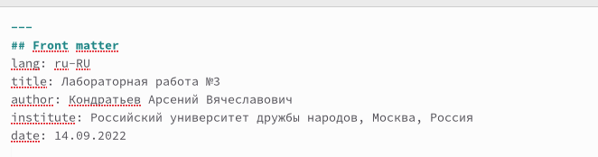
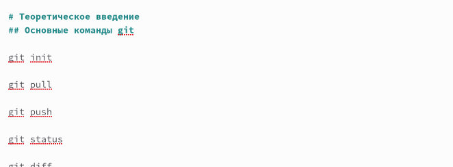
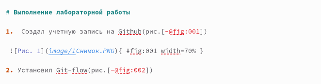
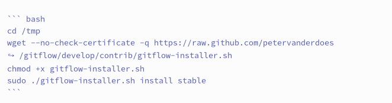
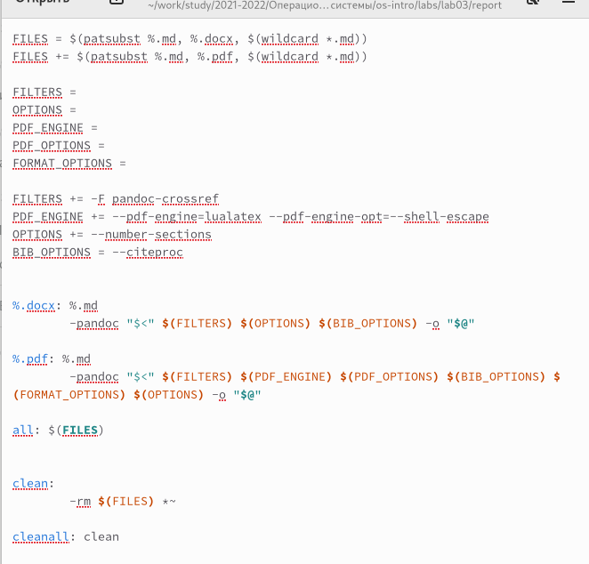
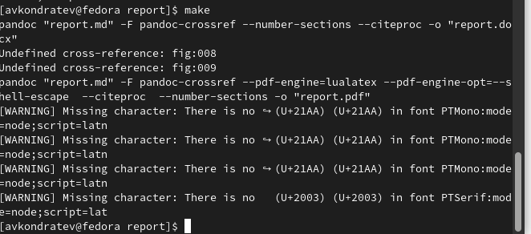
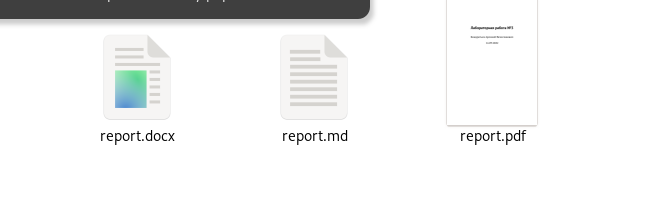

---
## Front matter
lang: ru-RU
title: "Лабораторная работа №3"
subtitle: "Дисциплина: Операционные системы"
author: Кондратьев Арсений Вячеславович
institute: Российский университет дружбы народов, Москва, Россия
date: 15.09.2022

## i18n babel
babel-lang: russian
babel-otherlangs: english

## Formatting pdf
toc: false
toc-title: Содержание
slide_level: 2
aspectratio: 169
section-titles: true
theme: metropolis
header-includes:
 - \metroset{progressbar=frametitle,sectionpage=progressbar,numbering=fraction}
 - '\makeatletter'
 - '\beamer@ignorenonframefalse'
 - '\makeatother'
---

# Цель работы

Научиться оформлять отчёты с помощью легковесного языка разметки Markdown.

# Выполнение лабораторной работы

1.	Оформил титульный лист(рис. [-@fig:001])

 { #fig:001 width=50% }
 
## Выполнение лабораторной работы

 2. Оформил теоретическое введение, используя разные уровни заголовков(рис. [-@fig:002])
 
 { #fig:002 width=50% }
 
## Выполнение лабораторной работы

 3. Прикрепил изображение, указав название, ссылку и размер(рис. [-@fig:003])
 
 { #fig:003 width=50% }
 
## Выполнение лабораторной работы

4. Встроил фрагмент кода с помощью тройных апострофов и указал язык bash(рис. [-@fig:004])

{ #fig:004 width=50% }

## Выполнение лабораторной работы

5. Ознакомился с Makefile`ом, в котором была прописана конвертация в docx и pdf, а также движок lualatex(рис. [-@fig:005])

{ #fig:005 width=50% }

## Выполнение лабораторной работы

6.	Запустил Makefile с помощью команды make, предварительно установив pandoc-crossref напрямую в папку bin(рис. [-@fig:006])

{ #fig:006 width=50% }

## Выполнение лабораторной работы

7. Получил на выход report.docx и report.pdf(рис. [-@fig:007])

{ #fig:007 width=50% }

# Вывод

Я научился оформлять отчёты с помощью легковесного языка разметки Markdown.

