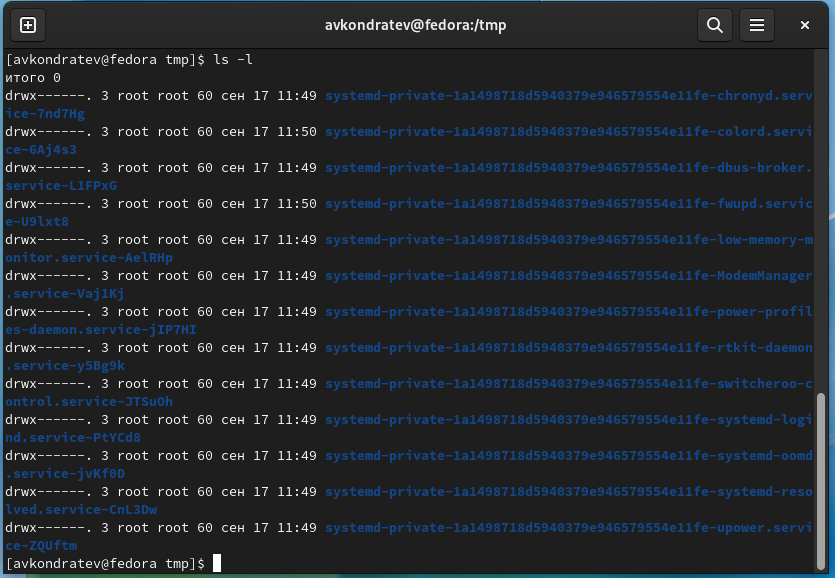
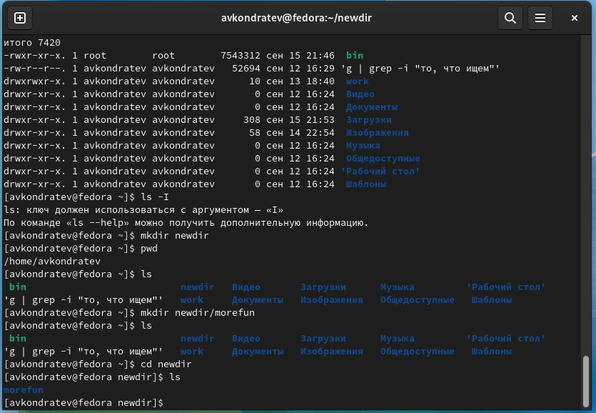

---
## Front matter
lang: ru-RU
title: "Лабораторная работа №4"
subtitle: "Дисциплина: Операционные системы"
author: Кондратьев Арсений Вячеславович
institute: Российский университет дружбы народов, Москва, Россия
date: 15.09.2022

## i18n babel
babel-lang: russian
babel-otherlangs: english

## Formatting pdf
toc: false
toc-title: Содержание
slide_level: 2
aspectratio: 169
section-titles: true
theme: metropolis
header-includes:
 - \metroset{progressbar=frametitle,sectionpage=progressbar,numbering=fraction}
 - '\makeatletter'
 - '\beamer@ignorenonframefalse'
 - '\makeatother'
---

# Цель работы

Приобретение практических навыков взаимодействия пользователя с системой посредством командной строки

# Выполнение лабораторной работы

1.	Определил полное имя домашнего каталога(рис.[-@fig:001])

 { #fig:001 width=70% }
 
## Выполнение лабораторной работы

 2. Вывел на экран содержимое каталога с опцией -а, которая показывает скрытые файлы(рис.[-@fig:002])

 { #fig:002 width=70% }
 
## Выполнение лабораторной работы

3. Вывел на экран содержимое каталога с опцией -l, которая показывает подробную информацию о файлах(рис.[-@fig:003])

 { #fig:003 width=70% }
 
## Выполнение лабораторной работы

4. Вывел на экран содержимое каталога с опциями -аlF, которые показывают скрытые файлы, подробную информацию и после каталогов ставят знак/, а после исполнительных файлов знак*(рис.[-@fig:004])

 { #fig:004 width=70% }

## Выполнение лабораторной работы

5. В домашнем каталоге создал каталог newdir, а в нем создал новый каталог с именем morefun(рис.[-@fig:005])

 { #fig:005 width=70% }

## Выполнение лабораторной работы

6.	В домашнем каталоге создал одной командой три новых каталога с именами
letters, memos, misk. Затем удалил их одной командой(рис.[-@fig:006])

 { #fig:006 width=70% }

## Выполнение лабораторной работы

7. Используя информацию, полученную при помощи команды history, выполнил модификацию и исполнение нескольких команд из буфера команд(рис.[-@fig:007])

 { #fig:007 width=70% }

# Вывод

Я приобрел практические навыки взаимодействия пользователя с системой посредством командной строки.

