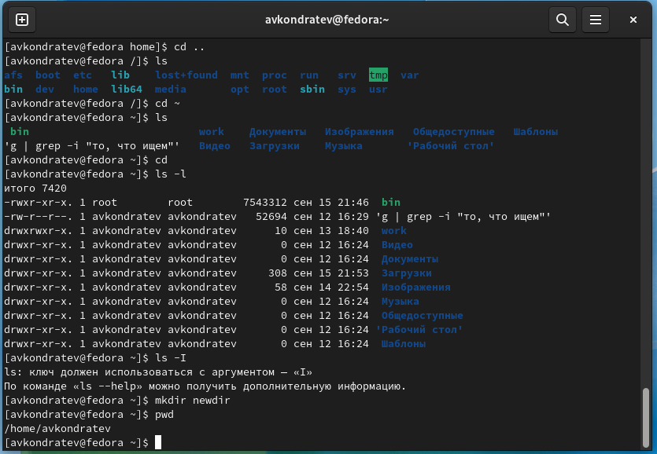
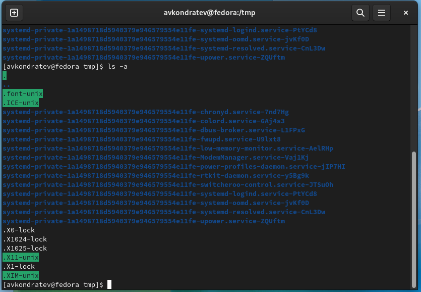
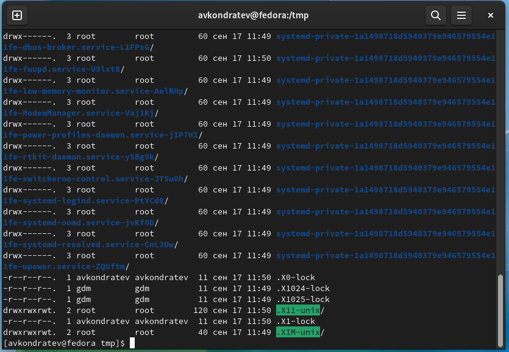
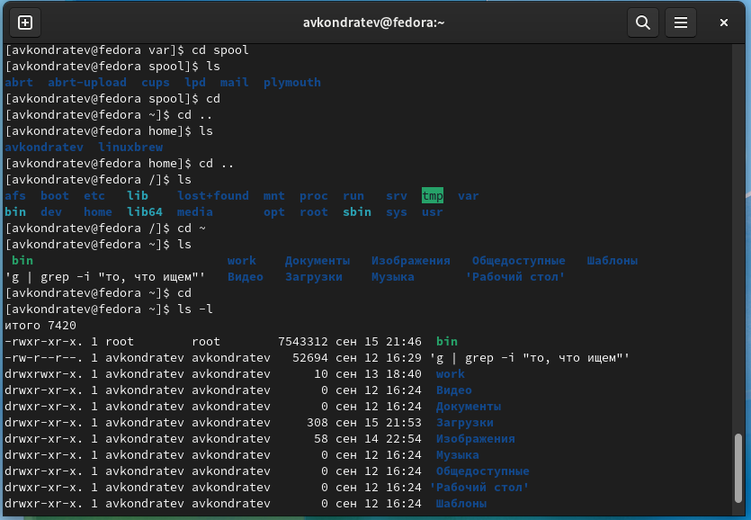
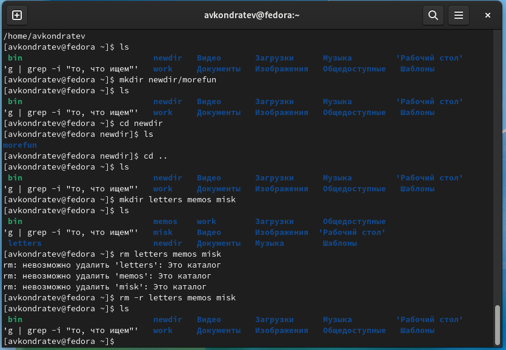
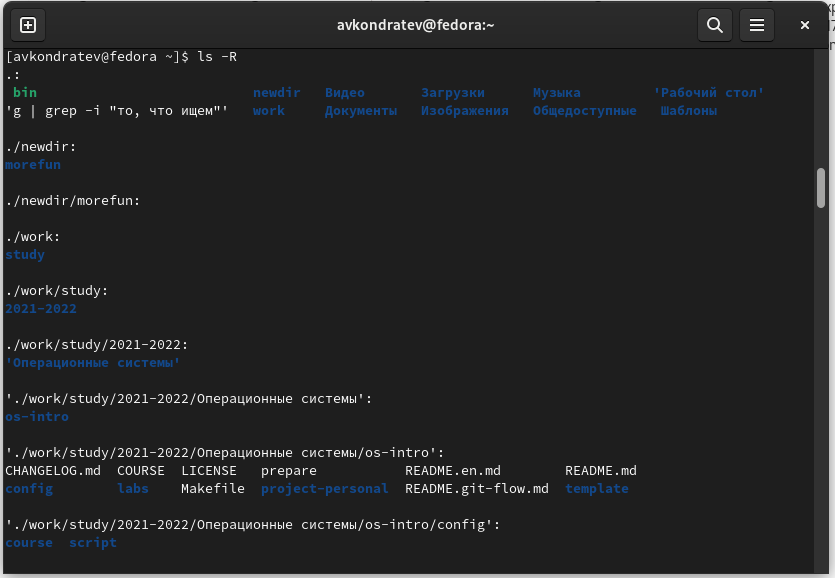
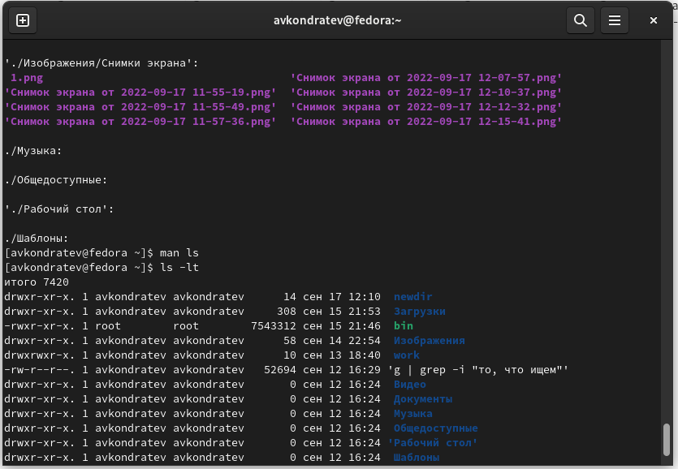
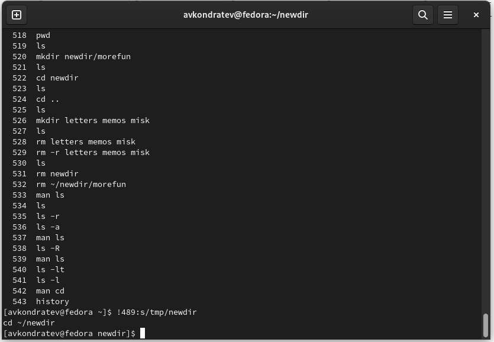

---
## Front matter
lang: ru-RU
title: "Лабораторная работа №4"
subtitle: "Дисциплина: Операционные системы"
author: "Кондратьев Арсений Вячеславович"
institute: "Российский университет дружбы народов, Москва, Россия"
date: 14.09.2022

## Generic otions
lang: ru-RU
toc-title: "Содержание"

## Bibliography
bibliography: bib/cite.bib
csl: pandoc/csl/gost-r-7-0-5-2008-numeric.csl

## Pdf output format
toc: true # Table of contents
toc-depth: 2

fontsize: 12pt
linestretch: 1.5
papersize: a4
documentclass: scrreprt
## I18n polyglossia
polyglossia-lang:
  name: russian
  options:
	- spelling=modern
	- babelshorthands=true
polyglossia-otherlangs:
  name: english
## I18n babel
babel-lang: russian
babel-otherlangs: english
## Fonts
mainfont: PT Serif
romanfont: PT Serif
sansfont: PT Sans
monofont: PT Mono
mainfontoptions: Ligatures=TeX
romanfontoptions: Ligatures=TeX
sansfontoptions: Ligatures=TeX,Scale=MatchLowercase
monofontoptions: Scale=MatchLowercase,Scale=0.9
## Biblatex
biblatex: true
biblio-style: "gost-numeric"
biblatexoptions:
  - parentracker=true
  - backend=biber
  - hyperref=auto
  - language=auto
  - autolang=other*
  - citestyle=gost-numeric


## Misc options
indent: true
header-includes:
  - \usepackage{indentfirst}
  - \usepackage{float} # keep figures where there are in the text
  - \floatplacement{figure}{H} # keep figures where there are in the text
---

# Цель работы

Приобретение практических навыков взаимодействия пользователя с системой посредством командной строки

# Теоретическое введение
## Основные команды

man - руководство по команде

cd - перемещение по файловой системе

pwd - определение абсолютного пути к текущему каталогу

ls - просмотр содержимого текущего каталога

mkdir - создание каталога

rm - удаление файлов

history - просмотр списка ранее выполненных команд

# Выполнение лабораторной работы

1.	Определил полное имя домашнего каталога(рис.[-@fig:001])

 { #fig:001 width=70% }
 
2. Вывел на экран содержимое каталога с опцией -а, которая показывает скрытые файлы(рис.[-@fig:002])

``` bash
ls -a
```

 { #fig:002 width=70% }
 
3. Вывел на экран содержимое каталога с опцией -l, которая показывает подробную информацию о файлах(рис.[-@fig:003])

``` bash
ls -l
```
    
 { #fig:003 width=70% }
 
4. Вывел на экран содержимое каталога с опциями -аlF, которые показывают скрытые файлы, подробную информацию и после каталогов ставят знак/, а после исполнительных файлов знак*(рис.[-@fig:004])

``` bash
ls -alF
```

 { #fig:004 width=70% }
 
5. Определил, что в каталоге /var/spool нет подкаталога cron.(рис.[-@fig:005])

Определил владельца файлов и подкаталогов в домашнем каталоге - это avkondratev(рис.[-@fig:005])

 { #fig:005 width=70% }
 
6. В домашнем каталоге создал каталог newdir, а в нем создал новый каталог с именем morefun(рис.[-@fig:006])

``` bash
mkdir newdir
mkdir newdir/morefun
```

 { #fig:006 width=70% }
 
7.	В домашнем каталоге создал одной командой три новых каталога с именами
letters, memos, misk(рис.[-@fig:007])

``` bash
mkdir letters memos misk
```

Затем удалил их одной командой(рис.[-@fig:007])

``` bash
rm -r letters memos misk
```

 { #fig:007 width=70% }
 
8. Сделал вывод, что команда rm не может удалить каталог newdir и morefun без опций(рис.[-@fig:008])

 { #fig:008 width=70% }
 
Удалил каталог morefun 
 
``` bash
rm -r ~/newdir/morefun
```
 
9. Определил, какую опцию команды ls нужно использовать для просмотра содержимое не только указанного каталога, но и подкаталогов,
входящих в него(рис.[-@fig:009])

``` bash
ls -R
```

 { #fig:009 width=70% }
 
10. Определил набор опций команды ls, позволяющий отсортировать по времени последнего изменения выводимый список содержимого каталога
с развёрнутым описанием файлов(рис.[-@fig:010])

``` bash
ls -lt
```

 { #fig:010 width=70% }
 
11. Просмотрел описание основных опций команд cd, pwd, mkdir, rmdir, rm

###cd

-L: Переходить по символическим ссылкам. Данное поведение используется по умолчанию.

-P: Разыменовывать символические ссылки. В данном случае, если осуществляется переход на символическую ссылку, которая указывает на директорию, то в результате команда cd изменит текущую рабочую директорию на директорию, указанную в качестве параметра.

-e: Выйти с ошибкой, если директория, в которую осуществляется переход, не найдена.

###pwd

-L: брать директорию из переменной окружения, даже если она содержит символические ссылки

-P: отбрасывать все символические ссылки

###mkdir

-m: назначить режим доступа

-p: не показывать ошибки, а также их игнорировать

-v: выводить сообщение о каждом новoм каталоге

###rmdir

-p:	Позволяет удалить каталог и вышележащие каталоги, оказавшиеся пустыми

-s:	Подавление сообщения, выдаваемого при действии опции -p

###rm

-f: дает возможность игнорировать несуществующие аргументы и определенные типы файлов

-i: перед удалением выводится запрос на подтверждение

-d:  удалить пустые директории

-r: yдаление директорий и их содержимого

12. Используя информацию, полученную при помощи команды history, выполнил модификацию и исполнение нескольких команд из буфера команд(рис.[-@fig:010])

``` bash
history
!489:s/tmp/newdir
```

 { #fig:011 width=70% }
 
# Выводы

Я приобрел практические навыки взаимодействия пользователя с системой посредством командной строки.

# Контрольные вопросы

1.	Командная строка - это интерфейс, с помощью которого пользователь может осуществлять управление системой посредством текстовых команд.

2. С помощью команды pwd

``` bash
pwd
```

/home/avkondratev

3. С помощью команды ls и опции -F

``` bash
ls -F
```

bit* work/ newdir/

4. С помощью опции ls -a

``` bash
ls -a
```

5. Файл можно удалить командой rm, а каталог командой rmdir либо rm -r

``` bash
rmdir newdir
```

6. С помощью команды history

7. C помощью восклицательного знака в начале

``` bash
!489:s/tmp/newdir
```

8. 
``` bash
cd ..; ls
```

9. Экранирование происходит с помощью обратного слэша\ перед нужным символом

10. Выводится полная информация о файлах

11. 
относительный

``` bash
cd ~/somedir/newdir
```

абсолютный

``` bash
ls /home/avkondratev/tmp/file1
```

12. С помощью команды man

13. Стрелка вверх


::: {#refs}
:::
