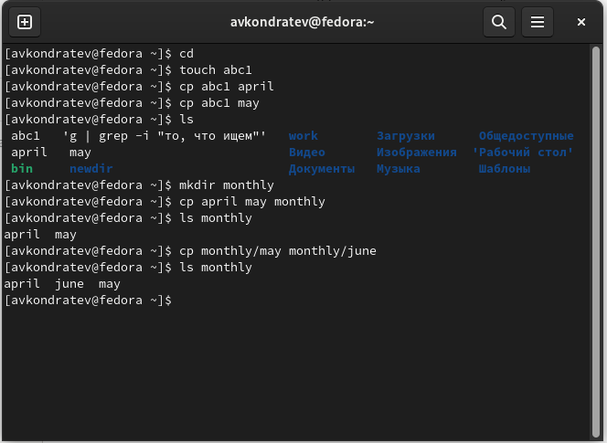
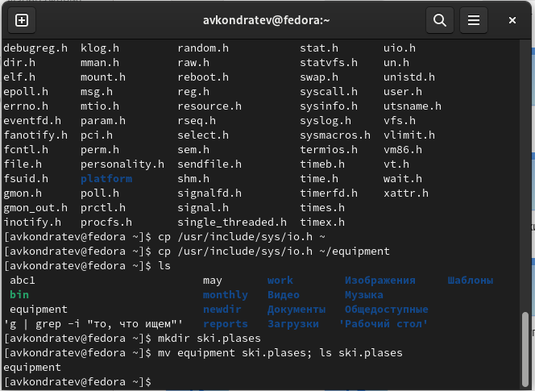
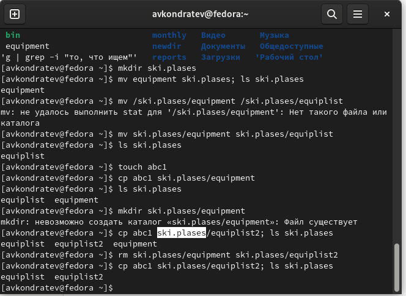
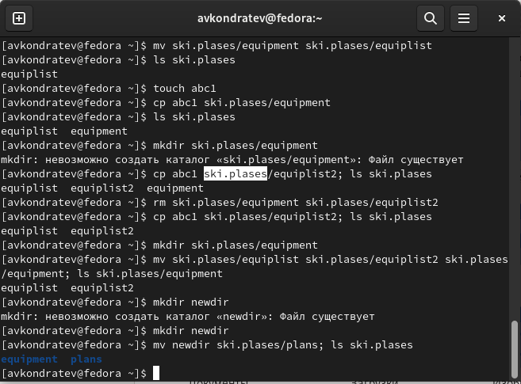

---
## Front matter
lang: ru-RU
title: "Лабораторная работа №5"
subtitle: "Дисциплина: Операционные системы"
author: Кондратьев Арсений Вячеславович
institute: Российский университет дружбы народов, Москва, Россия
date: 18.09.2022

## i18n babel
babel-lang: russian
babel-otherlangs: english

## Formatting pdf
toc: false
toc-title: Содержание
slide_level: 2
aspectratio: 169
section-titles: true
theme: metropolis
header-includes:
 - \metroset{progressbar=frametitle,sectionpage=progressbar,numbering=fraction}
 - '\makeatletter'
 - '\beamer@ignorenonframefalse'
 - '\makeatother'
---


# Цель работы

Ознакомление с файловой системой Linux, её структурой, именами и содержанием
каталогов. Приобретение практических навыков по применению команд для работы
с файлами и каталогами, по управлению процессами (и работами), по проверке использования диска и обслуживанию файловой системы.

# Выполнение лабораторной работы

1.	Выполнил примеры, описанные в первой части лабораторной работы

Скопировал файл ~/abc1 в файл april и в файл may(рис.[-@fig:001])

Скопировал файлы april и may в каталог monthly(рис.[-@fig:001])

Скопировал файл monthly/may в файл с именем june(рис.[-@fig:001])

 { #fig:001 width=50% }
 
## Выполнение лабораторной работы

 2. Скопировал каталог monthly в каталог monthly.00(рис.[-@fig:002])

 Скопировал каталог monthly.00 в каталог /tmp(рис.[-@fig:002])

 { #fig:002 width=50% }
 
## Выполнение лабораторной работы

3. Скопировал файл /usr/include/sys/io.h в домашний каталог и назвал его
equipment(рис.[-@fig:003])

``` bash
cp /usr/include/sys/io.h ~/equipment
```

 { #fig:003 width=50% }
 
## Выполнение лабораторной работы

4. В домашнем каталоге создал директорию ~/ski.plases.

 Переместил файл equipment в каталог ~/ski.plases(рис.[-@fig:004])

 { #fig:004 width=50% }

## Выполнение лабораторной работы

5. В домашнем каталоге создал каталог newdir, а в нем создал новый каталог с именем morefun(рис.[-@fig:005])

 { #fig:005 width=70% }

## Выполнение лабораторной работы

6.	Создал в домашнем каталоге файл abc1(рис.[-@fig:007])

Cкопировал его в каталог ~/ski.plases и назвал его equiplist2(рис.[-@fig:006])

 { #fig:006 width=50% }

## Выполнение лабораторной работы

7. Создал и переместил каталог ~/newdir в каталог ~/ski.plases и назвал
его plans(рис.[-@fig:007])

 { #fig:007 width=50% }
 
## Выполнение лабораторной работы

8. Определил опции команды chmod, необходимые для того, чтобы присвоить перечисленным файлам выделенные права доступа, считая, что в начале таких прав
нет(рис.[-@fig:008])

 { #fig:008 width=50% }
 
## Выполнение лабораторной работы

9. Проделал приведённые упражнения, записывая в отчёт по лабораторной
работе используемые при этом команды:

 Просмотрите содержимое файла /etc/password:
 
``` bash
cat etc/password
```

Скопируйте файл ~/feathers в файл ~/file.old

``` bash
cp feathers file.old
```

Переместите файл ~/file.old в каталог ~/play

``` bash
mv file.old play
```

## Выполнение лабораторной работы

Скопируйте каталог ~/play в каталог ~/fun

``` bash
cp play fun
```

Переместите каталог ~/fun в каталог ~/play и назовите его games

``` bash
mv fun play/games
```

Лишите владельца файла ~/feathers права на чтение

``` bash
chmod u-r feathers
```

## Выполнение лабораторной работы

Что произойдёт, если вы попытаетесь просмотреть файл ~/feathers командой
cat?

- Отказано в доступе

Что произойдёт, если вы попытаетесь скопировать файл ~/feathers?

- Отказано в доступе

Дайте владельцу файла ~/feathers право на чтение.

Лишите владельца каталога ~/play права на выполнение.

``` bash
chmod u-х play
```

# Вывод

Я ознакомился с файловой системой Linux, её структурой, именами и содержанием
каталогов. Приобрел практические навыки по применению команд для работы
с файлами и каталогами, по управлению процессами (и работами), по проверке использования диска и обслуживанию файловой системы.


