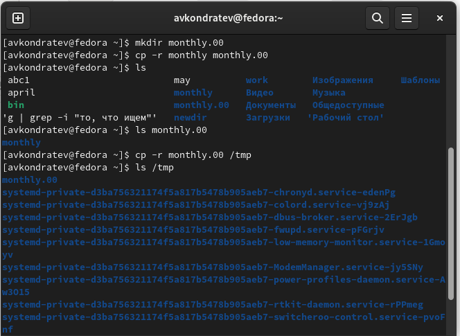
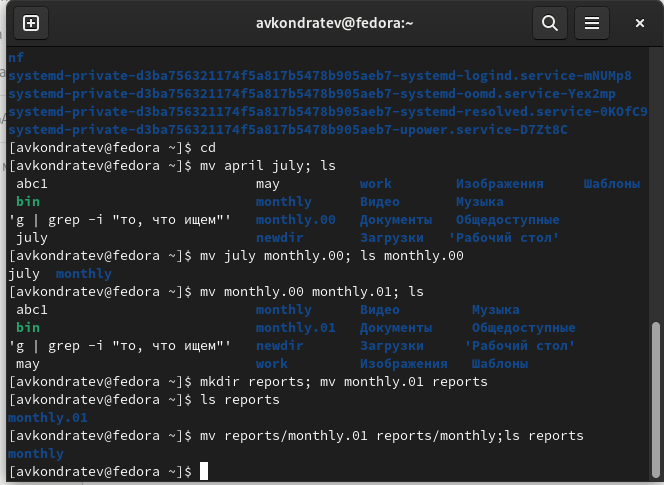
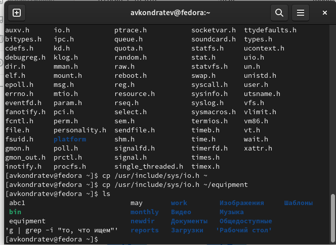
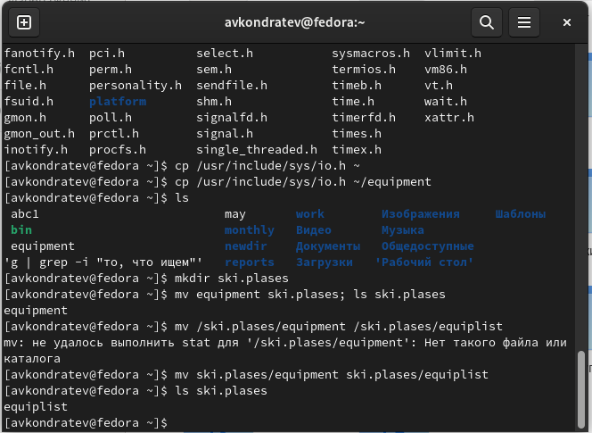
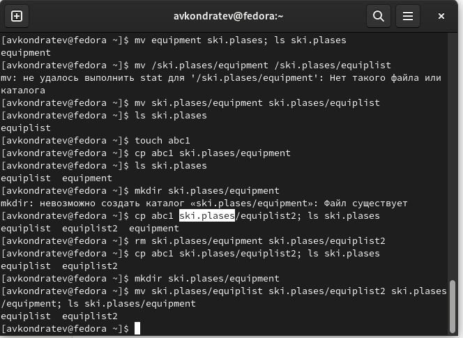
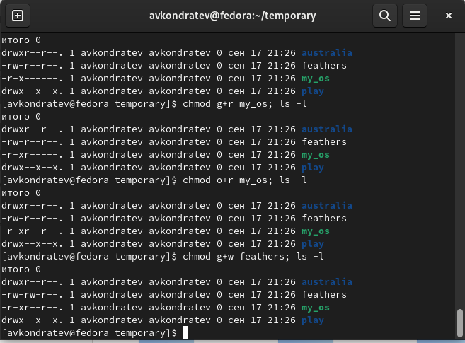

---
## Front matter
lang: ru-RU
title: "Лабораторная работа №5"
subtitle: "Дисциплина: Операционные системы"
author: "Кондратьев Арсений Вячеславович"
institute: "Российский университет дружбы народов, Москва, Россия"
date: 18.09.2022

## Generic otions
lang: ru-RU
toc-title: "Содержание"

## Bibliography
bibliography: bib/cite.bib
csl: pandoc/csl/gost-r-7-0-5-2008-numeric.csl

## Pdf output format
toc: true # Table of contents
toc-depth: 2

fontsize: 12pt
linestretch: 1.5
papersize: a4
documentclass: scrreprt
## I18n polyglossia
polyglossia-lang:
  name: russian
  options:
	- spelling=modern
	- babelshorthands=true
polyglossia-otherlangs:
  name: english
## I18n babel
babel-lang: russian
babel-otherlangs: english
## Fonts
mainfont: PT Serif
romanfont: PT Serif
sansfont: PT Sans
monofont: PT Mono
mainfontoptions: Ligatures=TeX
romanfontoptions: Ligatures=TeX
sansfontoptions: Ligatures=TeX,Scale=MatchLowercase
monofontoptions: Scale=MatchLowercase,Scale=0.9
## Biblatex
biblatex: true
biblio-style: "gost-numeric"
biblatexoptions:
  - parentracker=true
  - backend=biber
  - hyperref=auto
  - language=auto
  - autolang=other*
  - citestyle=gost-numeric


## Misc options
indent: true
header-includes:
  - \usepackage{indentfirst}
  - \usepackage{float} # keep figures where there are in the text
  - \floatplacement{figure}{H} # keep figures where there are in the text
---

# Цель работы

Ознакомление с файловой системой Linux, её структурой, именами и содержанием
каталогов. Приобретение практических навыков по применению команд для работы
с файлами и каталогами, по управлению процессами (и работами), по проверке использования диска и обслуживанию файловой системы.

# Теоретическое введение
## Основные команды

touch - создание текстового файла

cat - просмотр файлов небольшого размера

less - просмотр файлов постранично

cp - копирование файлов и каталогов

mv - перемещение и переименование файлов и каталогов

chmod - изменение прав доступа

fsck - проверка целостности файловой системы

# Выполнение лабораторной работы

1.	Выполнил примеры, описанные в первой части лабораторной работы

Скопировал файл ~/abc1 в файл april и в файл may(рис.[-@fig:001])

Скопировал файлы april и may в каталог monthly(рис.[-@fig:001])

Скопировал файл monthly/may в файл с именем june(рис.[-@fig:001])

 { #fig:001 width=70% }
 
 
2. Скопировал каталог monthly в каталог monthly.00(рис.[-@fig:002])

 Скопировал каталог monthly.00 в каталог /tmp(рис.[-@fig:002])

 { #fig:002 width=70% }
 
3. Изменил название файла april на july в домашнем каталоге(рис.[-@fig:003])

Переместил файл july в каталог monthly.00(рис.[-@fig:003])

Переименовал каталог monthly.00 в monthly.01(рис.[-@fig:003])

Переместил каталог monthly.01 в каталог reports(рис.[-@fig:003])

Переименовал каталог reports/monthly.01 в reports/monthly(рис.[-@fig:003])
    
 { #fig:003 width=70% }
 
4. Скопировал файл /usr/include/sys/io.h в домашний каталог и назвал его
equipment(рис.[-@fig:004])

``` bash
cp /usr/include/sys/io.h ~/equipment
```

 { #fig:004 width=70% }
 
5. В домашнем каталоге создал директорию ~/ski.plases.

 Переместил файл equipment в каталог ~/ski.plases(рис.[-@fig:005])

``` bash
mv equipment ski.plases
```

 { #fig:005 width=70% }
 
6. Переименовал файл ~/ski.plases/equipment в ~/ski.plases/equiplist(рис.[-@fig:006])

``` bash
mv /ski.plases/equipment ski.plases/equiplist
```

 { #fig:006 width=70% }
 
7.	Создал в домашнем каталоге файл abc1(рис.[-@fig:007])

``` bash
touch abc1
```

Cкопировал его в каталог ~/ski.plases и назвал его equiplist2(рис.[-@fig:007])

``` bash
cp abc1 ski.plases/equiplist2
```

 { #fig:007 width=70% }
 
8. Создал каталог с именем equipment в каталоге ~/ski.plases(рис.[-@fig:008])

Переместил файлы ~/ski.plases/equiplist и equiplist2 в каталог
~/ski.plases/equipment(рис.[-@fig:008])

``` bash
mv ski.plases/equiplist ski.plases/equiplist2 ski places/equipment
```

{ #fig:008 width=70% }
 
9. Создал и переместил каталог ~/newdir в каталог ~/ski.plases и назвал
его plans(рис.[-@fig:009])

``` bash
mkdir newdir
mv newdir ski.plases/plans
```

 { #fig:009 width=70% }
 
10. Определил опции команды chmod, необходимые для того, чтобы присвоить перечисленным файлам выделенные права доступа, считая, что в начале таких прав
нет(рис.[-@fig:010])

Для каталога australia

``` bash
chmod u+rwx australia
chmod g+r australia
chmod o+r australia
```

Для каталога play

``` bash
chmod u+rwx play
chmod g+x play
chmod o+x play
```

Для файла feathers

``` bash
chmod u+rw feathers
chmod g+rw feathers
chmod o+r feathers
```

Для файла my_os

``` bash
chmod u+rx feathers
chmod g+r feathers
chmod o+r feathers
```

 { #fig:010 width=70% }
 
11. Проделал приведённые упражнения, записывая в отчёт по лабораторной
работе используемые при этом команды:

 Просмотрите содержимое файла /etc/password:
 
``` bash
cat etc/password
```

Скопируйте файл ~/feathers в файл ~/file.old

``` bash
cp feathers file.old
```

Переместите файл ~/file.old в каталог ~/play

``` bash
mv file.old play
```

Скопируйте каталог ~/play в каталог ~/fun

``` bash
cp play fun
```

Переместите каталог ~/fun в каталог ~/play и назовите его games

``` bash
mv fun play/games
```

Лишите владельца файла ~/feathers права на чтение

``` bash
chmod u-r feathers
```

Что произойдёт, если вы попытаетесь просмотреть файл ~/feathers командой
cat?

- Отказано в доступе

Что произойдёт, если вы попытаетесь скопировать файл ~/feathers?

- Отказано в доступе

Дайте владельцу файла ~/feathers право на чтение.

Лишите владельца каталога ~/play права на выполнение.

``` bash
chmod u-х play
```

Перейдите в каталог ~/play. Что произошло?

- Отказано в доступе

Дайте владельцу каталога ~/play право на выполнение.

``` bash
chmod u+х play
```

12. 

mount - просмотр примонтированных устройств

fsck - проверка и починка файловых систем 

mkfs - создание файловой системы

kill - принудительное завершение процесса

# Выводы

Я ознакомился с файловой системой Linux, её структурой, именами и содержанием
каталогов. Приобрел практические навыки по применению команд для работы
с файлами и каталогами, по управлению процессами (и работами), по проверке использования диска и обслуживанию файловой системы.

# Контрольные вопросы

1.	

btrfs - файловая система, основанная на структурах B-деревьев и работающая по принципу «копирование при записи»

ext4 - журналируемая файловая система c увеличенным максимальным объёмом одного раздела диска до 1 эксбибайта при размере блока 4 кибибайт.

2. Программа не сохраняется в одной папке. Она распределяется по корневой файловой системе. По сути, file system в Linux начинается с директории «/» (которая называется корнем — от слова root) и разрастается в директории /sbin, /dev, /lib, /log, /boot и т.д. Получается древовидная иерархическая структура, в которой абсолютный путь к любой сущности начинается с корневой директории.

/bin : Все исполнимые бинарные программы (файлы) необходимые во время загрузки, восстановления и ремонта системы

/dev : Содержит файлы устройств для всех физических устройств на данной машине

/etc : Содержит файлы конфигурации приложений

3. Монтирование тома (mount)

4. Отсутствие синхронизации между образом файловой системы в памяти и ее данными на диске.

С помощью команды fsck

5. C помощью команды mkfs

6. cat - просмотр небольшого файла

less - просмотр файла постранично

head - просмотр первых n строк

tail - просмотр последних n строк

7. Копирование файлов и каталогов, копирование с переименованием

8. Перемещение, переименование, перемещение с переименованием

9. Совокупность правил, регламентирующих порядок и условия доступа субъекта к объектам информационной системы

С помощью команды chmod


::: {#refs}
:::
