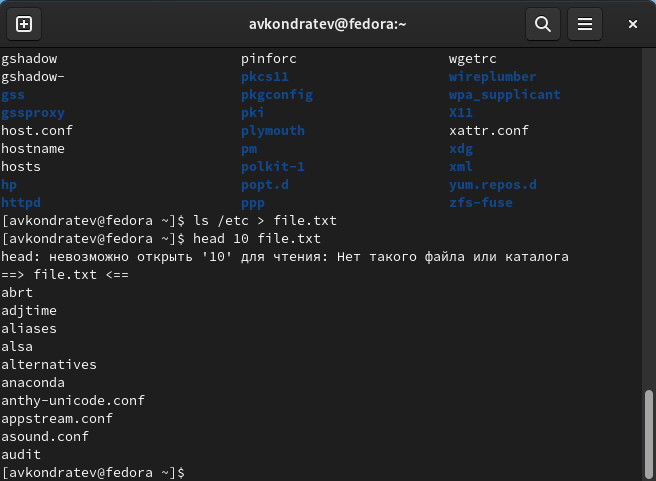
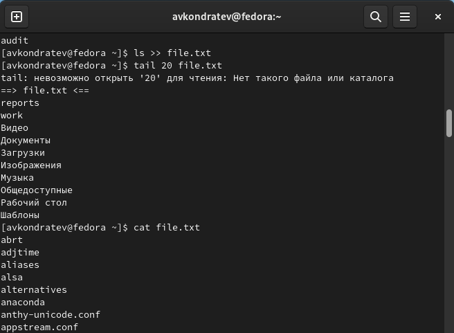
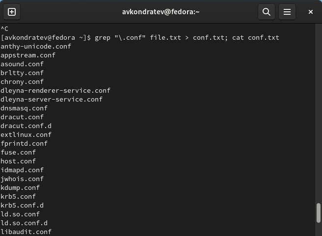
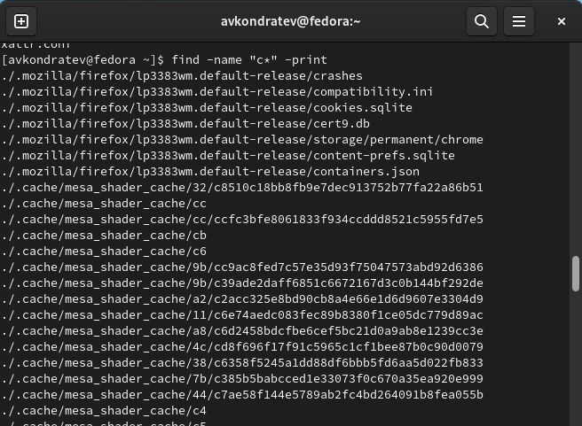
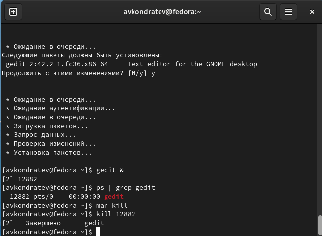
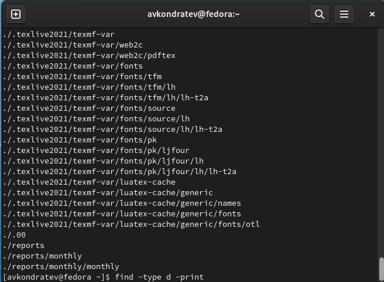

---
## Front matter
lang: ru-RU
title: "Лабораторная работа №6"
subtitle: "Дисциплина: Операционные системы"
author: Кондратьев Арсений Вячеславович
institute: Российский университет дружбы народов, Москва, Россия
date: 18.09.2022

## i18n babel
babel-lang: russian
babel-otherlangs: english

## Formatting pdf
toc: false
toc-title: Содержание
slide_level: 2
aspectratio: 169
section-titles: true
theme: metropolis
header-includes:
 - \metroset{progressbar=frametitle,sectionpage=progressbar,numbering=fraction}
 - '\makeatletter'
 - '\beamer@ignorenonframefalse'
 - '\makeatother'
---

# Цель работы

Ознакомление с инструментами поиска файлов и фильтрации текстовых данных.
Приобретение практических навыков: по управлению процессами (и заданиями), по
проверке использования диска и обслуживанию файловых систем.

# Выполнение лабораторной работы

1.	Записал в файл file.txt названия файлов, содержащихся в каталоге /etc.(рис.[-@fig:001])

 { #fig:001 width=50% }
 
## Выполнение лабораторной работы

 2. Дописал в этот же файл названия файлов, содержащихся в домашнем каталоге(рис.[-@fig:002])

 { #fig:002 width=50% }
 
## Выполнение лабораторной работы

3. Вывел имена всех файлов из file.txt, имеющих расширение .conf, после чего
записал их в новый текстовой файл conf.txt(рис.[-@fig:003])

 { #fig:003 width=50% }
 
## Выполнение лабораторной работы

4. Определил, какие файлы в вашем домашнем каталоге имеют имена, начинавшиеся
с символа c(рис.[-@fig:004])

 { #fig:004 width=50% }

## Выполнение лабораторной работы

5. Запустил в фоновом режиме процесс, который будет записывать в файл ~/logfile
файлы, имена которых начинаются с log(рис.[-@fig:005])

Затем удалил logfile

 { #fig:005 width=50% }

## Выполнение лабораторной работы

6.	Запустил из консоли в фоновом режиме редактор gedit(рис.[-@fig:006])

Определил идентификатор процесса gedit

Завершил процесс gedit с помощью команды kill

 { #fig:006 width=50% }

## Выполнение лабораторной работы

7. С помощью find, вывел имена всех директорий, имеющихся в домашнем каталоге(рис.[-@fig:007])

 { #fig:007 width=50% }
 
# Вывод

Я ознакомился с инструментами поиска файлов и фильтрации текстовых данных.
Приобрел практические навыки: по управлению процессами (и заданиями), по
проверке использования диска и обслуживанию файловых систем.

