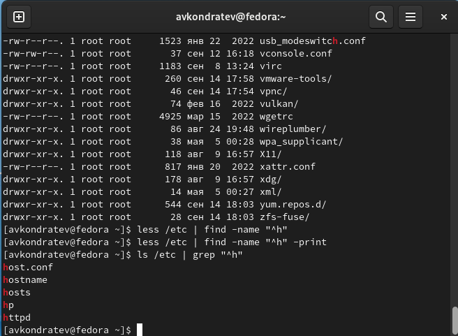
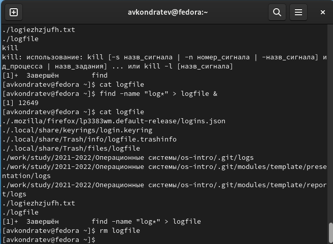
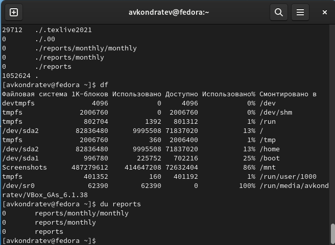

---
## Front matter
lang: ru-RU
title: "Лабораторная работа №6"
subtitle: "Дисциплина: Операционные системы"
author: "Кондратьев Арсений Вячеславович"
institute: "Российский университет дружбы народов, Москва, Россия"
date: 18.09.2022

## Generic otions
lang: ru-RU
toc-title: "Содержание"

## Bibliography
bibliography: bib/cite.bib
csl: pandoc/csl/gost-r-7-0-5-2008-numeric.csl

## Pdf output format
toc: true # Table of contents
toc-depth: 2

fontsize: 12pt
linestretch: 1.5
papersize: a4
documentclass: scrreprt
## I18n polyglossia
polyglossia-lang:
  name: russian
  options:
	- spelling=modern
	- babelshorthands=true
polyglossia-otherlangs:
  name: english
## I18n babel
babel-lang: russian
babel-otherlangs: english
## Fonts
mainfont: PT Serif
romanfont: PT Serif
sansfont: PT Sans
monofont: PT Mono
mainfontoptions: Ligatures=TeX
romanfontoptions: Ligatures=TeX
sansfontoptions: Ligatures=TeX,Scale=MatchLowercase
monofontoptions: Scale=MatchLowercase,Scale=0.9
## Biblatex
biblatex: true
biblio-style: "gost-numeric"
biblatexoptions:
  - parentracker=true
  - backend=biber
  - hyperref=auto
  - language=auto
  - autolang=other*
  - citestyle=gost-numeric


## Misc options
indent: true
header-includes:
  - \usepackage{indentfirst}
  - \usepackage{float} # keep figures where there are in the text
  - \floatplacement{figure}{H} # keep figures where there are in the text
---

# Цель работы

Ознакомление с инструментами поиска файлов и фильтрации текстовых данных.
Приобретение практических навыков: по управлению процессами (и заданиями), по
проверке использования диска и обслуживанию файловых систем.

# Теоретическое введение
## Основные команды

> - stdout

>> - stdout режим добавления

< - stdin

<< - stdin режим добавления

| - конвейер

find - поиск файла

grep - фильтрация текта

ps - информация о процессах

# Выполнение лабораторной работы

1.	Записал в файл file.txt названия файлов, содержащихся в каталоге /etc.(рис.[-@fig:001])

``` bash
ls .etc > file.txt
```

 { #fig:001 width=70% }
 
2. Дописал в этот же файл названия файлов, содержащихся в домашнем каталоге(рис.[-@fig:002])

``` bash
ls >> file.txt
```

 { #fig:002 width=70% }
 
3. Вывел имена всех файлов из file.txt, имеющих расширение .conf, после чего
записал их в новый текстовой файл conf.txt(рис.[-@fig:003])
    
``` bash
grep "\.conf" file.txt > conf.txt
```

 { #fig:003 width=70% }
 
4. Определил, какие файлы в вашем домашнем каталоге имеют имена, начинавшиеся
с символа c(рис.[-@fig:004])

С помощью команды find 

``` bash
find -name "c*" -print
```

Также можно с помощью фильтрации

``` bash
ls | grep "^c"
```

 { #fig:004 width=70% }
 
5. Вывел на экран (по странично) имена файлов из каталога /etc, начинающиеся
с символа h(рис.[-@fig:005])

``` bash
ls /etc | grep "^h"
```

 { #fig:005 width=70% }
 
6. Запустил в фоновом режиме процесс, который будет записывать в файл ~/logfile
файлы, имена которых начинаются с log(рис.[-@fig:006])

Затем удалил logfile

``` bash
find -name "log*" > logfile &
rm logfile
```

 { #fig:006 width=70% }
 
7.	Запустил из консоли в фоновом режиме редактор gedit(рис.[-@fig:007])

Определил идентификатор процесса gedit

Завершил процесс gedit с помощью команды kill

``` bash
gedit &
ps | grep gedit
kill 12882
```

 { #fig:007 width=70% }
 
8. Выполнил команды df и du(рис.[-@fig:008])

{ #fig:008 width=70% }
 
9. С помощью find, вывел имена всех директорий, имеющихся в домашнем каталоге(рис.[-@fig:009])

``` bash
find -type d -print
```

 { #fig:009 width=70% }

# Выводы

Я ознакомился с инструментами поиска файлов и фильтрации текстовых данных.
Приобрел практические навыки: по управлению процессами (и заданиями), по
проверке использования диска и обслуживанию файловых систем.

# Контрольные вопросы

1.	

> - stdout

>> - stdout режим добавления

< - stdin

<< - stdin режим добавления

&> - stderr

2. 

> - создает или пересоздает файл

>> - дополняет файл

3. Конвейер - это цепочка, объединяющая команды

4. 

Процесс - это выполнение программы

Программа - это набор команд

5. 

PID - process ID (идентификатор процесса)

GID - group ID (идентификатор группы)

6. 

Задача - это выполняющаяся в консоли команда

kill - завершение задачи

& - запуск задачи в фоновом режиме

7. 

top (table of processes) — консольная команда, которая выводит список работающих в системе процессов и информацию о них

htop — продвинутый монитор процессов, показывает динамический список системных процессов, список обычно выравнивается по использованию ЦПУ.

8. 

Команда find

``` bash
find -type d -print
```

9. Можно, с помощью команды grep -r (осуществление поиска рекурсивно)

10. С помощью команд df и du

``` bash
df -h
```

``` bash
du -h
```

11. С помощью команды du

``` bash
du ~
```

12. С помощью команды kill


::: {#refs}
:::
