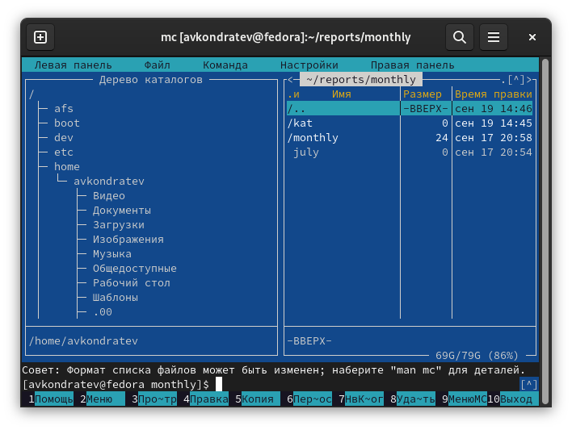
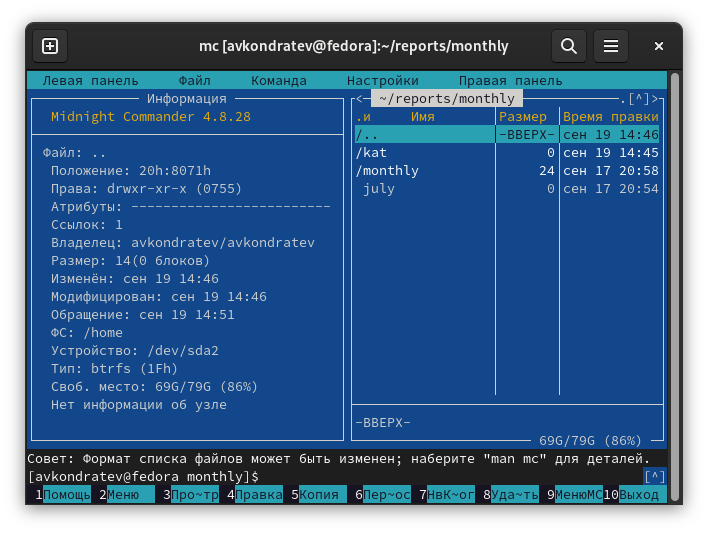
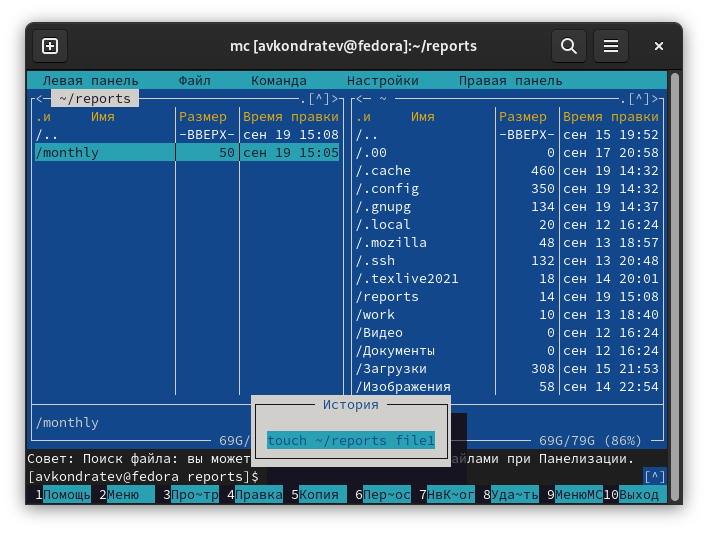
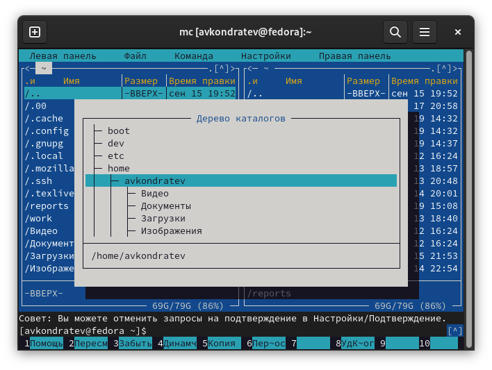
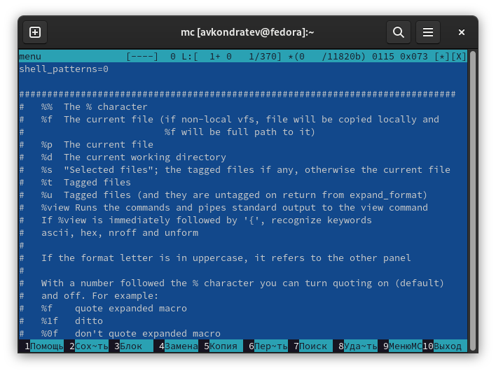
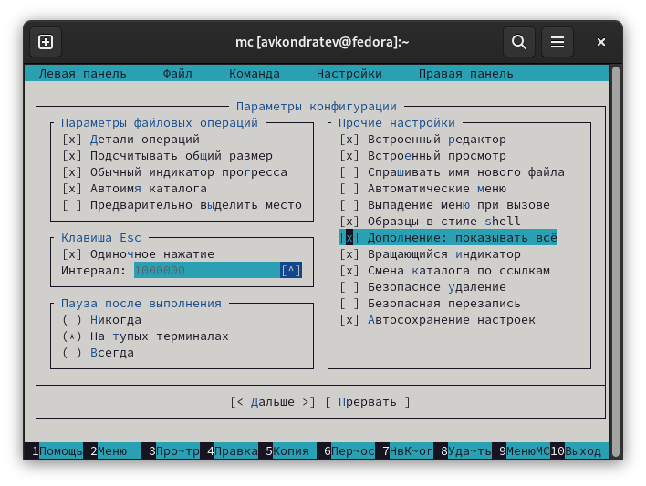
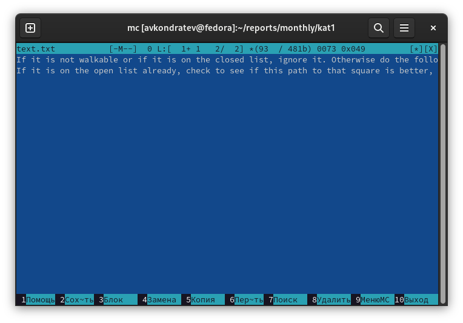
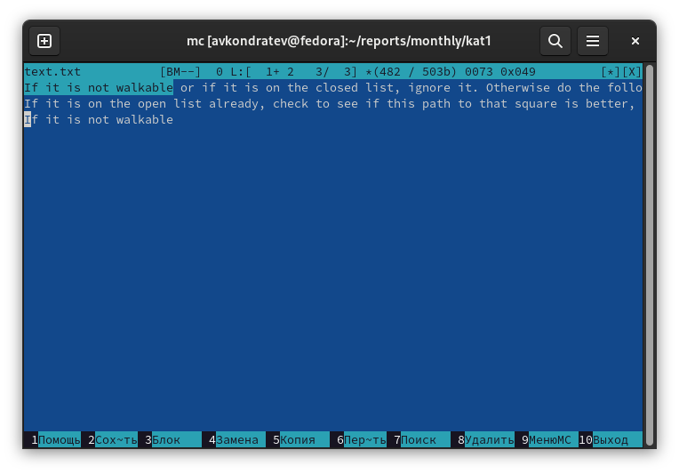
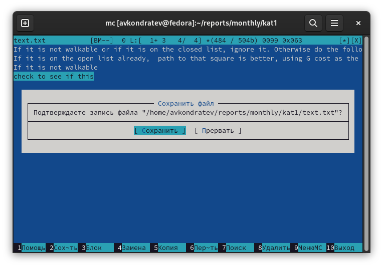
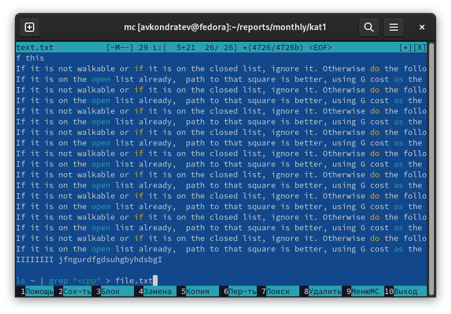

---
## Front matter
lang: ru-RU
title: "Лабораторная работа №7"
subtitle: "Дисциплина: Операционные системы"
author: Кондратьев Арсений Вячеславович
institute: Российский университет дружбы народов, Москва, Россия
date: 19.09.2022

## i18n babel
babel-lang: russian
babel-otherlangs: english

## Formatting pdf
toc: false
toc-title: Содержание
slide_level: 2
aspectratio: 169
section-titles: true
theme: metropolis
header-includes:
 - \metroset{progressbar=frametitle,sectionpage=progressbar,numbering=fraction}
 - '\makeatletter'
 - '\beamer@ignorenonframefalse'
 - '\makeatother'
---

# Цель работы

Освоение основных возможностей командной оболочки Midnight Commander. Приобретение навыков практической работы по просмотру каталогов и файлов; манипуляций
с ними.

# Выполнение лабораторной работы

1. Выполнил основные команды меню панели(рис.[-@fig:001])

 { #fig:001 width=50% }
 
## Выполнение лабораторной работы

 { #fig:002 width=50% }
 
## Выполнение лабораторной работы

3. С помощью соответствующих средств подменю Команда осуществил:

Поиск в файловой системе файла с заданными условиями(рис.[-@fig:003])

{ #fig:003 width=50% }

## Выполнение лабораторной работы

Выбор и повторение одной из предыдущих команд(рис.[-@fig:004])

{ #fig:004 width=50% }

## Выполнение лабораторной работы

Переход в домашний каталог(рис.[-@fig:005])

{ #fig:005 width=50% }

## Выполнение лабораторной работы

Анализ файла меню и файла расширений(рис.[-@fig:006])

{ #fig:006 width=50% }
 
## Выполнение лабораторной работы

4. Освоил операции, определяющие структуру экрана mc(рис.[-@fig:007])

 { #fig:007 width=50% }
 
## Выполнение лабораторной работы

5. Создал text.txt, открыл его с помощью mc и вставил в него небольшой фрагмент текста(рис.[-@fig:008])

 { #fig:008 width=50% }

## Выполнение лабораторной работы

6.	Удалил строку текста(рис.[-@fig:009])

 { #fig:009 width=50% }

## Выполнение лабораторной работы

7. Выделил фрагмент текста и скопировал его на новую строку(рис.[-@fig:015])

{ #fig:010 width=50% }

## Выполнение лабораторной работы

8. Выделил фрагмент текста и перенес его на новую строку(рис.[-@fig:011])

 { #fig:011 width=50% }

## Выполнение лабораторной работы

 9. Сохранил файл(рис.[-@fig:012])

 { #fig:012 width=50% }

## Выполнение лабораторной работы

 10. Включил подсветку синтаксиса(рис.[-@fig:013])

 { #fig:013 width=50% }
 
# Вывод

Я освоил основные возможности командной оболочки Midnight Commander. Приобрел навыки практической работы по просмотру каталогов и файлов; манипуляций
с ними

