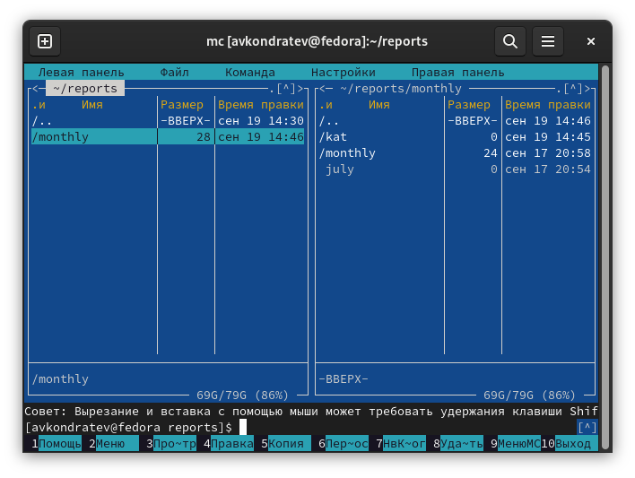
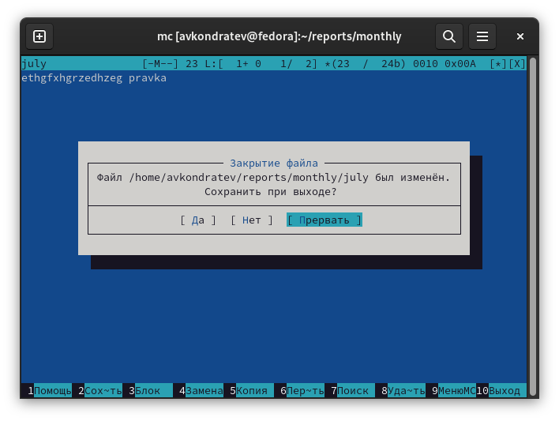
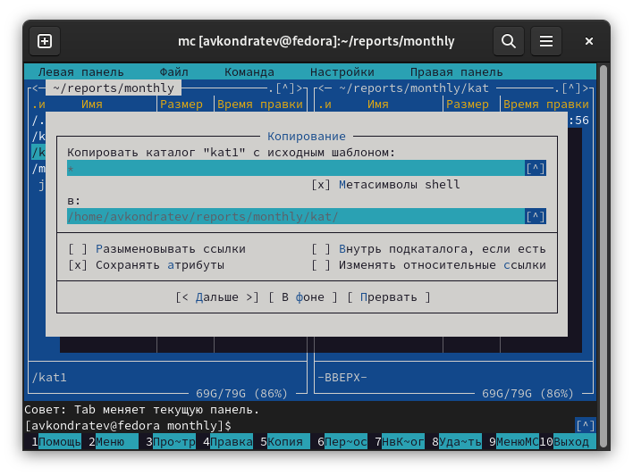
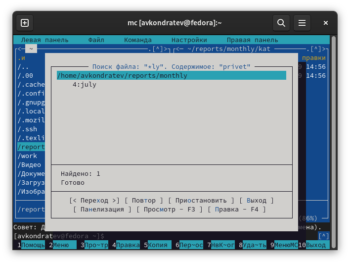
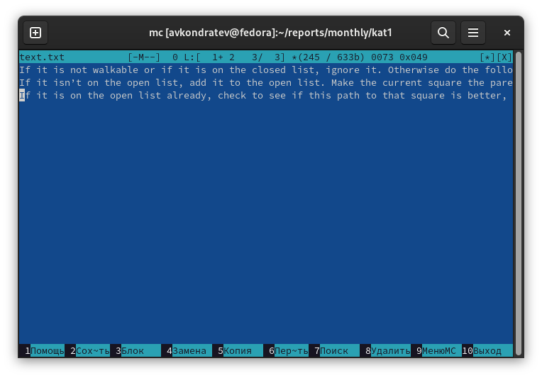
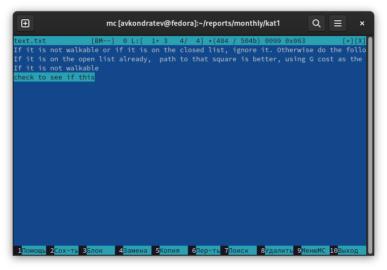

---
## Front matter
lang: ru-RU
title: "Лабораторная работа №7"
subtitle: "Дисциплина: Операционные системы"
author: "Кондратьев Арсений Вячеславович"
institute: "Российский университет дружбы народов, Москва, Россия"
date: 19.09.2022

## Generic otions
lang: ru-RU
toc-title: "Содержание"

## Bibliography
bibliography: bib/cite.bib
csl: pandoc/csl/gost-r-7-0-5-2008-numeric.csl

## Pdf output format
toc: true # Table of contents
toc-depth: 2

fontsize: 12pt
linestretch: 1.5
papersize: a4
documentclass: scrreprt
## I18n polyglossia
polyglossia-lang:
  name: russian
  options:
	- spelling=modern
	- babelshorthands=true
polyglossia-otherlangs:
  name: english
## I18n babel
babel-lang: russian
babel-otherlangs: english
## Fonts
mainfont: PT Serif
romanfont: PT Serif
sansfont: PT Sans
monofont: PT Mono
mainfontoptions: Ligatures=TeX
romanfontoptions: Ligatures=TeX
sansfontoptions: Ligatures=TeX,Scale=MatchLowercase
monofontoptions: Scale=MatchLowercase,Scale=0.9
## Biblatex
biblatex: true
biblio-style: "gost-numeric"
biblatexoptions:
  - parentracker=true
  - backend=biber
  - hyperref=auto
  - language=auto
  - autolang=other*
  - citestyle=gost-numeric

## Misc options
indent: true
header-includes:
  - \usepackage{indentfirst}
  - \usepackage{float} # keep figures where there are in the text
  - \floatplacement{figure}{H} # keep figures where there are in the text
---

# Цель работы

Освоение основных возможностей командной оболочки Midnight Commander. Приобретение навыков практической работы по просмотру каталогов и файлов; манипуляций
с ними.

# Теоретическое введение
## Основные команды

F1 Вызов контекстно-зависимой подсказки

F2 Вызов пользовательского меню с возможностью создания и/или дополнения дополнительных функций

F3 Просмотр содержимого файла, на который указывает подсветка в активной панели (без возможности редактирования)

F4 Вызов встроенного в mc редактора для изменения содержания файла,
на который указывает подсветка в активной панели

F5 Копирование одного или нескольких файлов, отмеченных в первой
(активной) панели, в каталог, отображаемый на второй панели

F6 Перенос одного или нескольких файлов, отмеченных в первой (активной) панели, в каталог, отображаемый на второй панели

F7 Создание подкаталога в каталоге, отображаемом в активной панели

F8 Удаление одного или нескольких файлов (каталогов), отмеченных в первой (активной) панели файлов

F9 Вызов меню mc

F10 Выход из mc

# Выполнение лабораторной работы

1.	Создал каталог kat, копировал его в каталог monthly, удалил каталог kat из reports(рис.[-@fig:001])

 { #fig:001 width=70% }
 
2. Выполнил основные команды меню панели(рис.[-@fig:002])

 { #fig:002 width=70% }
 
 { #fig:003 width=70% }
 
3. Просмотрел содержимое текстового файла(рис.[-@fig:004])

 { #fig:004 width=70% }
 
 Редактирование содержимого текстового файла (без сохранения результатов
редактирования)(рис.[-@fig:005])
 
 { #fig:005 width=70% }
 
 Создание каталога(рис.[-@fig:006])
 
 { #fig:006 width=70% }
 
 Копирование в файлов в созданный каталог(рис.[-@fig:007])
 
 { #fig:007 width=70% }
 
4. С помощью соответствующих средств подменю Команда осуществил:

Поиск в файловой системе файла с заданными условиями(рис.[-@fig:008])

{ #fig:008 width=70% }

Выбор и повторение одной из предыдущих команд(рис.[-@fig:009])

{ #fig:009 width=70% }

Переход в домашний каталог(рис.[-@fig:010])

{ #fig:010 width=70% }

Анализ файла меню и файла расширений(рис.[-@fig:011])

{ #fig:011 width=70% }
 
5. Освоил операции, определяющие структуру экрана mc(рис.[-@fig:012])

 { #fig:012 width=70% }
 
6. Создал text.txt, открыл его с помощью mc и вставил в него небольшой фрагмент текста(рис.[-@fig:013])

 { #fig:013 width=70% }
 
7.	Удалил строку текста(рис.[-@fig:014])

 { #fig:014 width=70% }
 
8. Выделил фрагмент текста и скопировал его на новую строку(рис.[-@fig:015])

{ #fig:015 width=70% }
 
9. Выделил фрагмент текста и перенес его на новую строку(рис.[-@fig:016])

 { #fig:016 width=70% }
 
 10. Сохранил файл(рис.[-@fig:017])

 { #fig:017 width=70% }
 
 11. Включил подсветку синтаксиса(рис.[-@fig:018])

 { #fig:018 width=70% }

# Выводы

Я освоил основные возможности командной оболочки Midnight Commander. Приобрел навыки практической работы по просмотру каталогов и файлов; манипуляций
с ними

# Контрольные вопросы

1. Работа с панелью, где дан список файлов

Работа с файлами - создание редактирование

Работа с командами - поиск файлов,  сравнение файлов

2. 
Просмотр, правка, копирование, перенос, изменение атрибутов, переименование, создание, удаление

F8 - удаление (rm path filename)

F4 - правка

F5 - копирование (cp filename path)

3. 

Список файлов - показывает файлы списком

Быстрый просмотр - быстрый просмотр содержимого панели

Информация - показывает информацию о файле

Дерево - показывает файлы деревом

4. 

Просмотр - просмотр файла

Правка - редактирование файла

Копирование

Права доступа - изменение прав доступа

Переименование 

Создание каталога

Удаление

5. 

Дерево каталогов - показывает дерево каталогов

Поиск файла

Переставить панели - меняет панели местами

Отключить панели - отключает панели, чтобы можно было подробнее видеть консоль

Сравнить каталоги

Сравнить файлы

Внешняя панелизация

Размеры каталогов

История командной строки - показывает ранее выполненные команды и позволяет выполнить выбранную команду

6. 

Конфигурация - открывает параметры конфигурации 

Внешний вид - открывает параметры внешнего вида панелей

Настройки панелей - позволяет настроить отображения в панелях

Подтверждение - позволяет выбрать на какие действия нужно подтверждение

Оформление - позволяет настроить оформление

Биты символов - настройка отображения символов

Распознавание клавиш - позволяет настроить комбинации

Виртуальная ФС - настройка виртуальной файловой системы

7. 

F1 Вызов контекстно-зависимой подсказки

F2 Вызов пользовательского меню с возможностью создания и/или дополнения дополнительных функций

F3 Просмотр содержимого файла, на который указывает подсветка в активной панели (без возможности редактирования)

F4 Вызов встроенного в mc редактора для изменения содержания файла,
на который указывает подсветка в активной панели

F5 Копирование одного или нескольких файлов, отмеченных в первой
(активной) панели, в каталог, отображаемый на второй панели

F6 Перенос одного или нескольких файлов, отмеченных в первой (активной) панели, в каталог, отображаемый на второй панели

F7 Создание подкаталога в каталоге, отображаемом в активной панели

F8 Удаление одного или нескольких файлов (каталогов), отмеченных в первой (активной) панели файлов

F9 Вызов меню mc

F10 Выход из mc

8. 

Ctrl-y удалить строку

Ctrl-u отмена последней операции

Ins вставка/замена

F7 поиск (можно использовать регулярные выражения)

F4 замена

F3 первое нажатие — начало выделения, второе — окончание
выделения

F5 копировать выделенный фрагмент

F6 переместить выделенный фрагмент

F8 удалить выделенный фрагмент

F2 записать изменения в файл

F10 выйти из редактора

10. 

Просмотр - просмотр файла

Правка - редактирование файла

Копирование

Права доступа - изменение прав доступа

Переименование 

Удаление

::: {#refs}
:::
