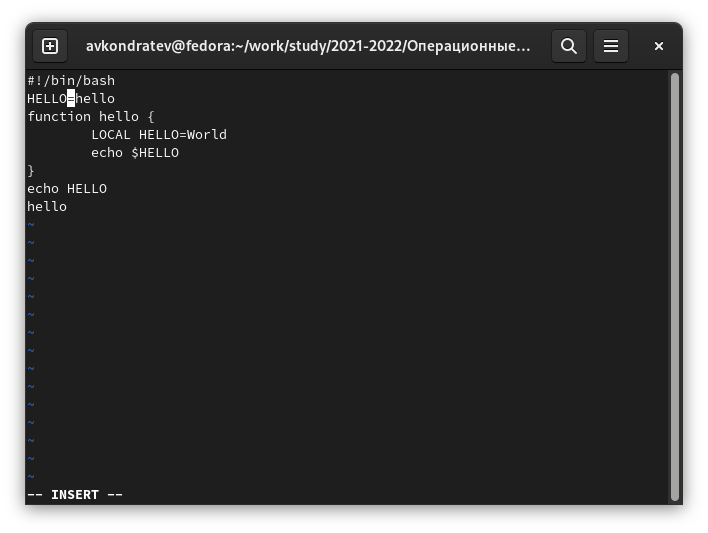
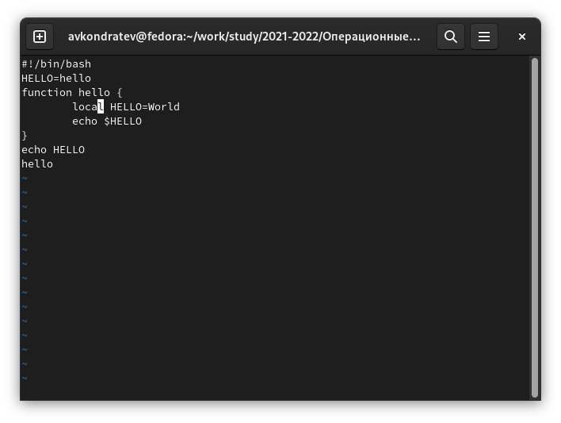
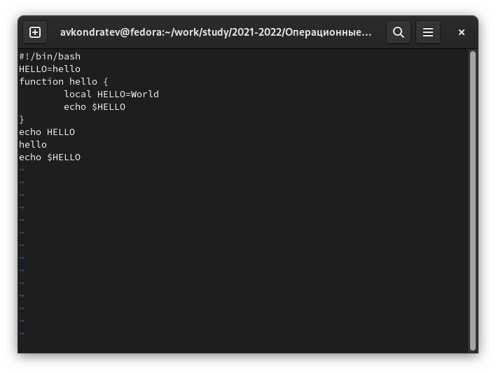
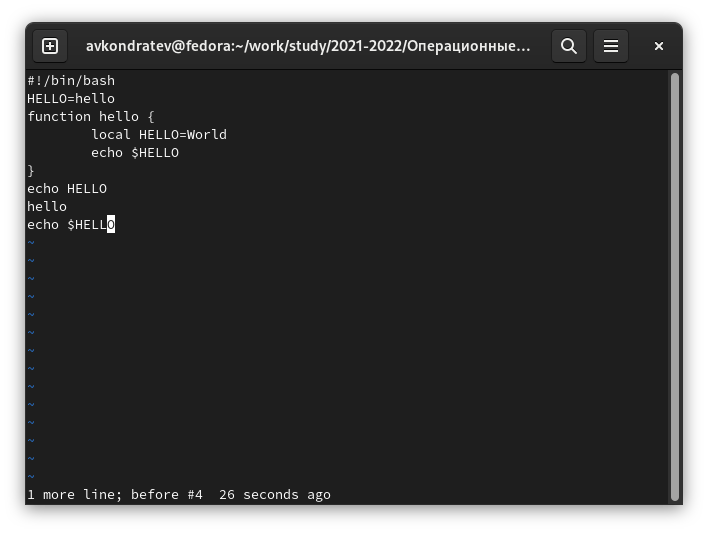

---
## Front matter
lang: ru-RU
title: "Лабораторная работа №8"
subtitle: "Дисциплина: Операционные системы"
author: Кондратьев Арсений Вячеславович
institute: Российский университет дружбы народов, Москва, Россия
date: 20.09.2022

## i18n babel
babel-lang: russian
babel-otherlangs: english

## Formatting pdf
toc: false
toc-title: Содержание
slide_level: 2
aspectratio: 169
section-titles: true
theme: metropolis
header-includes:
 - \metroset{progressbar=frametitle,sectionpage=progressbar,numbering=fraction}
 - '\makeatletter'
 - '\beamer@ignorenonframefalse'
 - '\makeatother'
---


# Цель работы

Познакомиться с операционной системой Linux. Получить практические навыки работы с редактором vi, установленным по умолчанию практически во всех дистрибутивах.

# Выполнение лабораторной работы

1.	Нажал клавишу i и ввел следующий текст(рис.[-@fig:001])

 { #fig:001 width=70% }
 
## Выполнение лабораторной работы

 2. Сделал файл исполняемым(рис.[-@fig:002])

``` bash
chmod +x hello.sh
```
 
 { #fig:002 width=70% }
 
## Выполнение лабораторной работы

3. Установил курсор в конец слова HELL второй строки.(рис.[-@fig:003])

 Перешел в режим вставки и заменил на HELLO. Нажал Esc для возврата в командный режим(рис.[-@fig:003])

{ #fig:003 width=70% }
 
## Выполнение лабораторной работы

4. Установил курсор на четвертую строку и стер слово LOCAL.

Перешел в режим вставки и набрал следующий текст: local, нажал Esc для
возврата в командный режим.(рис.[-@fig:004])

 { #fig:004 width=70% }

## Выполнение лабораторной работы

5. Установил курсор на последней строке файла. Вставил после неё строку, содержащую следующий текст: echo $HELLO.(рис.[-@fig:005])

 { #fig:005 width=70% }

## Выполнение лабораторной работы

6.	Удалил последнюю строку(рис.[-@fig:006])

 { #fig:006 width=70% }

## Выполнение лабораторной работы

7. Ввел команду отмены изменений u для отмены последней команды(рис.[-@fig:007])

{ #fig:007 width=70% }
 
# Вывод

Я познакомился с операционной системой Linux. Получил практические навыки работы с редактором vi, установленным по умолчанию практически во всех дистрибутивах.


