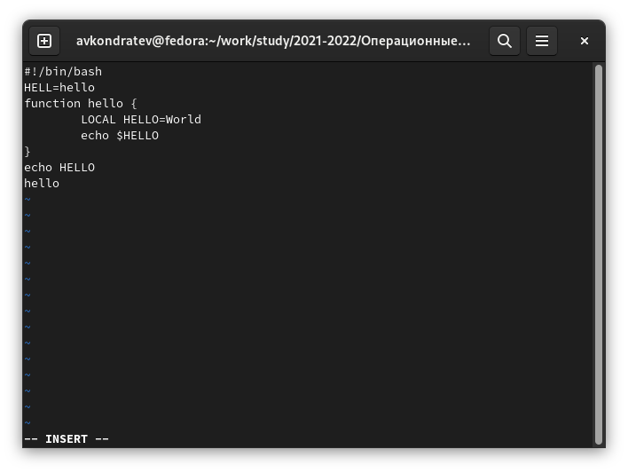
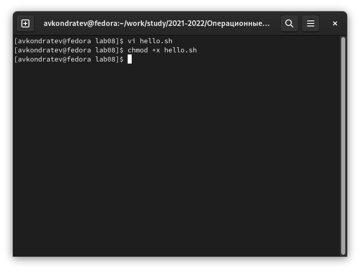

---
## Front matter
lang: ru-RU
title: "Лабораторная работа №8"
subtitle: "Дисциплина: Операционные системы"
author: "Кондратьев Арсений Вячеславович"
institute: "Российский университет дружбы народов, Москва, Россия"
date: 20.09.2022

## Generic otions
lang: ru-RU
toc-title: "Содержание"

## Bibliography
bibliography: bib/cite.bib
csl: pandoc/csl/gost-r-7-0-5-2008-numeric.csl

## Pdf output format
toc: true # Table of contents
toc-depth: 2

fontsize: 12pt
linestretch: 1.5
papersize: a4
documentclass: scrreprt
## I18n polyglossia
polyglossia-lang:
  name: russian
  options:
	- spelling=modern
	- babelshorthands=true
polyglossia-otherlangs:
  name: english
## I18n babel
babel-lang: russian
babel-otherlangs: english
## Fonts
mainfont: PT Serif
romanfont: PT Serif
sansfont: PT Sans
monofont: PT Mono
mainfontoptions: Ligatures=TeX
romanfontoptions: Ligatures=TeX
sansfontoptions: Ligatures=TeX,Scale=MatchLowercase
monofontoptions: Scale=MatchLowercase,Scale=0.9
## Biblatex
biblatex: true
biblio-style: "gost-numeric"
biblatexoptions:
  - parentracker=true
  - backend=biber
  - hyperref=auto
  - language=auto
  - autolang=other*
  - citestyle=gost-numeric


## Misc options
indent: true
header-includes:
  - \usepackage{indentfirst}
  - \usepackage{float} # keep figures where there are in the text
  - \floatplacement{figure}{H} # keep figures where there are in the text
---

# Цель работы

Познакомиться с операционной системой Linux. Получить практические навыки работы с редактором vi, установленным по умолчанию практически во всех дистрибутивах.

# Теоретическое введение
## Основные команды

– 0 (ноль) — переход в начало строки;

– $ — переход в конец строки;

– G — переход в конец файла;

– n G — переход на строку с номером n.

– а — вставить текст после курсора;

– А — вставить текст в конец строки;

– i — вставить текст перед курсором;

– n i — вставить текст n раз;

– I — вставить текст в начало строки.

# Выполнение лабораторной работы

1.	Нажал клавишу i и ввел следующий текст(рис.[-@fig:001])

 { #fig:001 width=70% }
 
2. Нажал клавишу Esc для перехода в командный режим после завершения ввода
текста.

 Нажал : для перехода в режим последней строки
 
 Нажал w (записать) и q (выйти), а затем клавишу Enter для сохранения текста и завершения работы 
  
3. Сделайте файл исполняемым(рис.[-@fig:002])

``` bash
chmod +x hello.sh
```
 
 { #fig:002 width=70% }
 
4. Установил курсор в конец слова HELL второй строки.(рис.[-@fig:003])

 Перешел в режим вставки и заменил на HELLO. Нажал Esc для возврата в командный режим(рис.[-@fig:003])

{ #fig:003 width=70% }
 
5. Установил курсор на четвертую строку и стер слово LOCAL.

Перешел в режим вставки и набрал следующий текст: local, нажал Esc для
возврата в командный режим.(рис.[-@fig:004])

 { #fig:004 width=70% }
 
6. Установил курсор на последней строке файла. Вставил после неё строку, содержащую следующий текст: echo $HELLO.(рис.[-@fig:005])

 { #fig:005 width=70% }
 
7.	Удалил последнюю строку(рис.[-@fig:006])

 { #fig:006 width=70% }
 
8. Ввел команду отмены изменений u для отмены последней команды(рис.[-@fig:007])

{ #fig:007 width=70% }

# Выводы

Я познакомился с операционной системой Linux. Получил практические навыки работы с редактором vi, установленным по умолчанию практически во всех дистрибутивах.

# Контрольные вопросы

1. 

Командный режим — предназначен для ввода команд редактирования и навигации по
редактируемому файлу;

Режим вставки — предназначен для ввода содержания редактируемого файла;

Режим последней (или командной) строки — используется для записи изменений в файл
и выхода из редактора.

2. Нажать : , написать q и нажать Enter

3. 

0 (ноль) — переход в начало строки;

$ — переход в конец строки;

клавиша G — переход в конец файла;

n + клавиша G — переход на строку с номером n

4. Набор символов ограниченный пробелами или переносом строки

5. 

0 (ноль) — переход в начало строки;

$ — переход в конец строки;

6. 

x — удалить один символ в буфер;

d w — удалить одно слово в буфер;

d $ — удалить в буфер текст от курсора до конца строки;

d 0 — удалить в буфер текст от начала строки до позиции курсора;

d d — удалить в буфер одну строку;

n + d + d — удалить в буфер n строк

7. Заполнить строку символом $

8. Клавиша u

9. 

: w — записать изменённый текст в файл, не выходя из vi;

: w имя-файла — записать изменённый текст в новый файл с именем имя-файла;

: w ! имя-файла — записать изменённый текст в файл с именем имя-файла;

: w q — записать изменения в файл и выйти из vi;

: q — выйти из редактора vi;

: q ! — выйти из редактора без записи;

10. Клавиша $ 

11. 

 -r восстановить файл, если не сохранили при некорректном завершении
 
 -t	Эквивалент первоначальной команды tag; редактирует файл, содержащий признак tag (тег), и устанавливает редактор согласно определению этого признака
 
 -l	Специфическая для редактирования LISP, эта опция устанавливает опции showmatch и lisp
 
 -Wn	По умолчанию устанавливает "окно" размером 'n'
 
 -R	Устанавливает опцию "только чтение"
 
12. Внизу окна

insert - режим вставки

: - режим командной строки

ничего, если командный режим


::: {#refs}
:::
