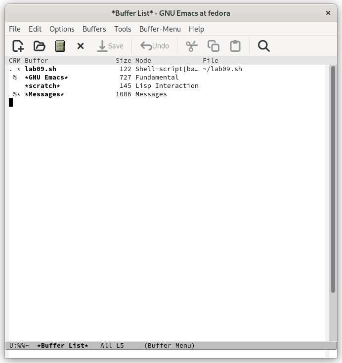
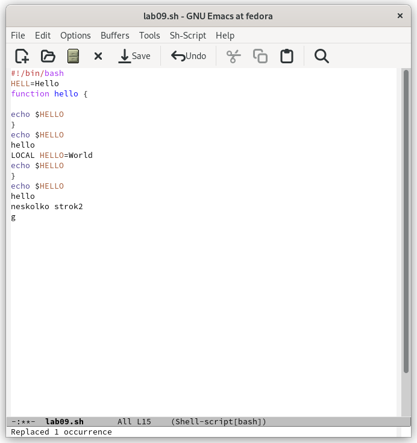

---
## Front matter
lang: ru-RU
title: "Лабораторная работа №9"
subtitle: "Дисциплина: Операционные системы"
author: Кондратьев Арсений Вячеславович
institute: Российский университет дружбы народов, Москва, Россия
date: 20.09.2022

## i18n babel
babel-lang: russian
babel-otherlangs: english

## Formatting pdf
toc: false
toc-title: Содержание
slide_level: 2
aspectratio: 169
section-titles: true
theme: metropolis
header-includes:
 - \metroset{progressbar=frametitle,sectionpage=progressbar,numbering=fraction}
 - '\makeatletter'
 - '\beamer@ignorenonframefalse'
 - '\makeatother'
---

# Цель работы

Познакомиться с операционной системой Linux. Получить практические навыки работы с редактором Emacs.

# Выполнение лабораторной работы

1.	Создал файл lab09.sh с помощью комбинации (C-x C-f) и набрал данный текст(рис.[-@fig:001])

Сохранил файл с помощью комбинации (C-x C-s)(рис.[-@fig:001])

 { #fig:001 width=30% }
 
## Выполнение лабораторной работы

 2. Проделал с текстом стандартные процедуры редактирования:

 Вырезать одной командой целую строку (С-k)(рис.[-@fig:002])
 
 { #fig:002 width=30% }
 
## Выполнение лабораторной работы
 
 Вставить эту строку в конец файла (C-y)(рис.[-@fig:003])
 
 { #fig:003 width=40% }
 
## Выполнение лабораторной работы

3. Освоил управление буферами.(рис.[-@fig:004])

Переместиться во вновь открытое окно (C-x) o со списком открытых буферов
и переключиться на другой буфер(рис.[-@fig:004])

{ #fig:004 width=30% }
 
## Выполнение лабораторной работы

4. Освоил управление окнами:

Поделил фрейм на 4 части: разделил фрейм на два окна по вертикали (C-x 3),
а затем каждое из этих окон на две части по горизонтали (C-x 2)(рис.[-@fig:005])

 { #fig:005 width=30% }

## Выполнение лабораторной работы

6. Освоил режим поиска
Переключился в режим поиска (C-s) и нашел несколько слов, присутствующих
в тексте(рис.[-@fig:006])

 { #fig:006 width=30% }

## Выполнение лабораторной работы

Перешел в режим поиска и замены (M-%) и заменил слово(рис.[-@fig:007])
 
 { #fig:007 width=40% }

## Выполнение лабораторной работы

Испробовал другой режим поиска, нажав M-s o. (рис.[-@fig:008])

{ #fig:008 width=40% }

Он отличается от обычного тем, что искомые слова выводятся в отдельном окне вместе со строкой.
 
# Вывод

Я познакомился с операционной системой Linux. Получил практические навыки работы с редактором Emacs.

