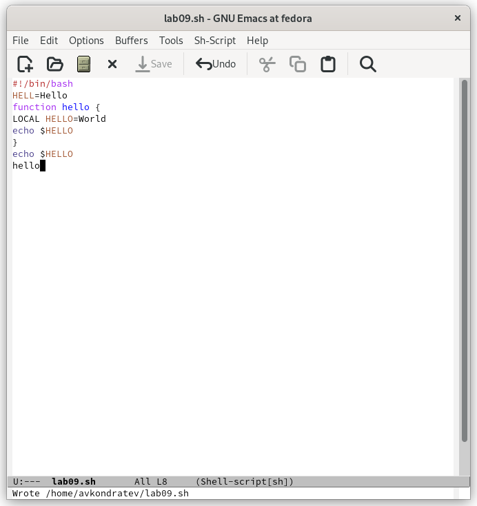
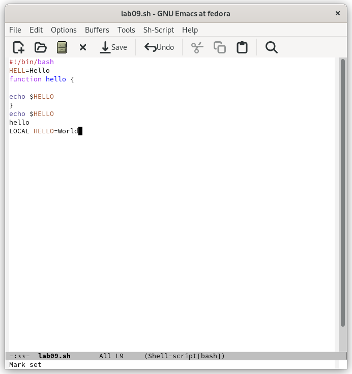
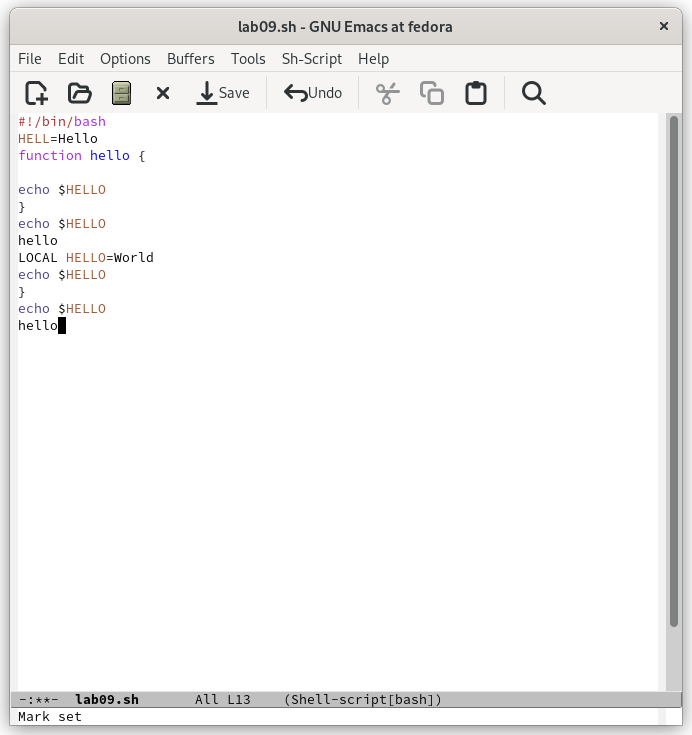
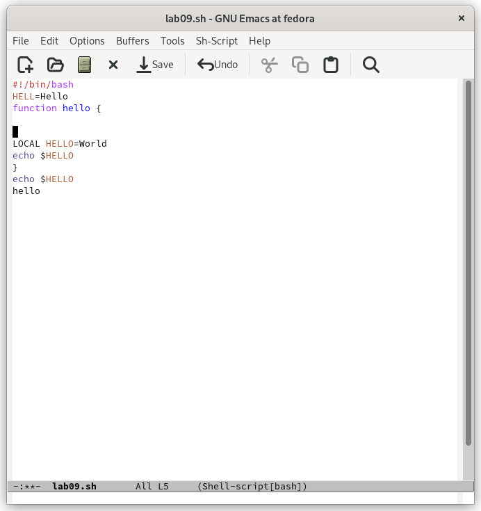
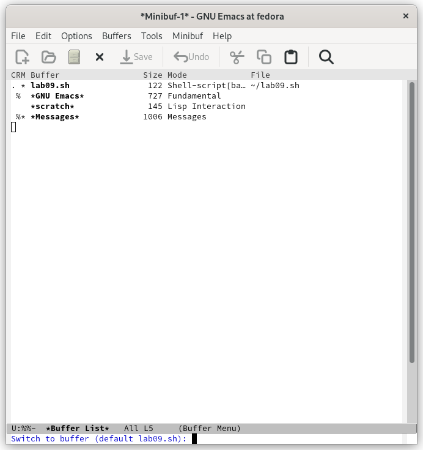
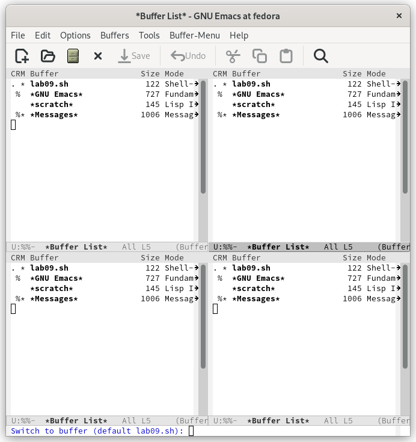
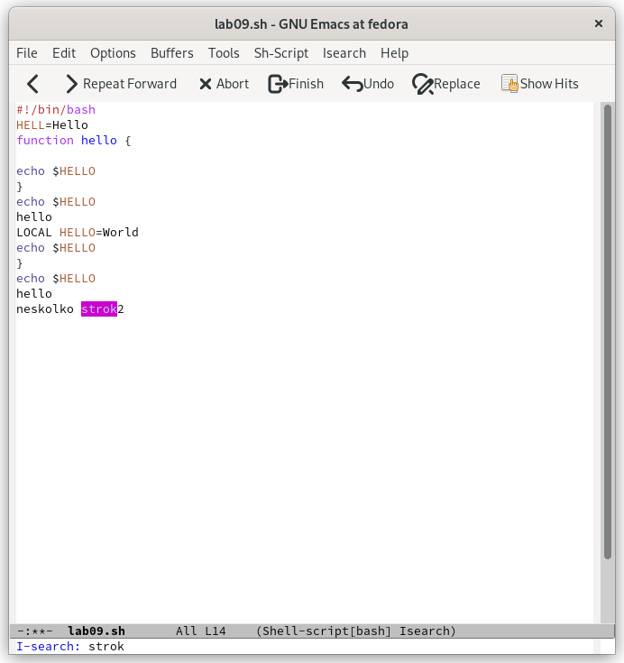
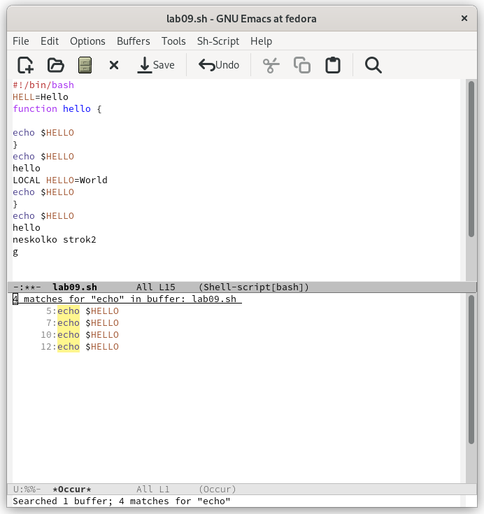

---
## Front matter
lang: ru-RU
title: "Лабораторная работа №9"
subtitle: "Дисциплина: Операционные системы"
author: "Кондратьев Арсений Вячеславович"
institute: "Российский университет дружбы народов, Москва, Россия"
date: 20.09.2022

## Generic otions
lang: ru-RU
toc-title: "Содержание"

## Bibliography
bibliography: bib/cite.bib
csl: pandoc/csl/gost-r-7-0-5-2008-numeric.csl

## Pdf output format
toc: true # Table of contents
toc-depth: 2

fontsize: 12pt
linestretch: 1.5
papersize: a4
documentclass: scrreprt
## I18n polyglossia
polyglossia-lang:
  name: russian
  options:
	- spelling=modern
	- babelshorthands=true
polyglossia-otherlangs:
  name: english
## I18n babel
babel-lang: russian
babel-otherlangs: english
## Fonts
mainfont: PT Serif
romanfont: PT Serif
sansfont: PT Sans
monofont: PT Mono
mainfontoptions: Ligatures=TeX
romanfontoptions: Ligatures=TeX
sansfontoptions: Ligatures=TeX,Scale=MatchLowercase
monofontoptions: Scale=MatchLowercase,Scale=0.9
## Biblatex
biblatex: true
biblio-style: "gost-numeric"
biblatexoptions:
  - parentracker=true
  - backend=biber
  - hyperref=auto
  - language=auto
  - autolang=other*
  - citestyle=gost-numeric

## Misc options
indent: true
header-includes:
  - \usepackage{indentfirst}
  - \usepackage{float} # keep figures where there are in the text
  - \floatplacement{figure}{H} # keep figures where there are in the text
---

# Цель работы

Познакомиться с операционной системой Linux. Получить практические навыки работы с редактором Emacs.

# Теоретическое введение

Буфер — объект, представляющий какой-либо текст.

Фрейм соответствует окну в обычном понимании этого слова. Каждый
фрейм содержит область вывода и одно или несколько окон Emacs.

Окно — прямоугольная область фрейма, отображающая один из буферов.

# Выполнение лабораторной работы

1.	Создал файл lab07.sh с помощью комбинации (C-x C-f) и набрал данный текст(рис.[-@fig:001])

Сохранил файл с помощью комбинации (C-x C-s)(рис.[-@fig:001])

 { #fig:001 width=70% }
 
2. Проделал с текстом стандартные процедуры редактирования:

 Вырезать одной командой целую строку (С-k)(рис.[-@fig:002])
 
 { #fig:002 width=70% }
 
 Вставить эту строку в конец файла (C-y)(рис.[-@fig:003])
 
 { #fig:003 width=70% }
 
 Выделить область текста (C-space).  
 Скопировать область в буфер обмена (M-w).  
 Вставить область в конец файла.(рис.[-@fig:004])
 
 { #fig:004 width=70% }
 
 Вновь выделить эту область и на этот раз вырезать её (C-w).(рис.[-@fig:005])
 
 { #fig:005 width=70% }
 
 Отменить последнее действие (C-/).(рис.[-@fig:006])
 
 { #fig:006 width=70% }
 
3. Научился использовать команды по перемещению курсора:

 Переместите курсор в начало строки (C-a).
 Переместите курсор в конец строки (C-e).
 Переместите курсор в начало буфера (M-<).
 Переместите курсор в конец буфера (M->).
  
4. Освоил управление буферами.(рис.[-@fig:003])

 Вывести список активных буферов на экран (C-x C-b)(рис.[-@fig:007])

{ #fig:007 width=70% }

Переместиться во вновь открытое окно (C-x) o со списком открытых буферов
и переключиться на другой буфер(рис.[-@fig:008])

{ #fig:008 width=70% }

Закрыл это окно (C-x 0).  
Теперь вновь переключаться между буферами, но уже без вывода их списка на
экран (C-x b)(рис.[-@fig:009])
 
 { #fig:009 width=70% }
 
5. Освоил управление окнами:

Поделил фрейм на 4 части: разделил фрейм на два окна по вертикали (C-x 3),
а затем каждое из этих окон на две части по горизонтали (C-x 2)(рис.[-@fig:010])

 { #fig:010 width=70% }
 
 В каждом из четырёх созданных окон открыл новый буфер (файл) и ввел
несколько строк текста(рис.[-@fig:011])

{ #fig:011 width=70% }
 
6. Освоил режим поиска
Переключился в режим поиска (C-s) и нашел несколько слов, присутствующих
в тексте(рис.[-@fig:012])

 { #fig:012 width=70% }
 
 Переключился между результатами поиска, нажимая C-s(рис.[-@fig:013])
 
 { #fig:013 width=70% }
 
 Перешел в режим поиска и замены (M-%) и заменил слово(рис.[-@fig:014])
 
 { #fig:014 width=70% }
 
Испробовал другой режим поиска, нажав M-s o. (рис.[-@fig:015])

{ #fig:015 width=70% }

Он отличается от обычного тем, что искомые слова выводятся в отдельном окне вместе со строкой.

# Выводы

Я познакомился с операционной системой Linux. Получил практические навыки работы с редактором Emacs.

# Контрольные вопросы

1. Emacs представляет собой мощный экранный редактор текста, написанный на языке
высокого уровня Elisp.

2. Нужно знать перечень комбинаций. Работа со строкой.

3. Буфер - файл с текстом

Окно - пространство для работы с текстом

4. Да

5. TUTORIAL.ru; GNU Emacs

6. ctrl-c | ctrl-c ctrl-i

7. По вертикали (C-x 3)

По горизонтали (C-x 2)

8. ".emacs" в каталоге пользователя

9. Удаляет символ, можно, в файле ".emacs"

10. vi кажется проще, но в emacs больше функций, поэтому emacs

::: {#refs}
:::
