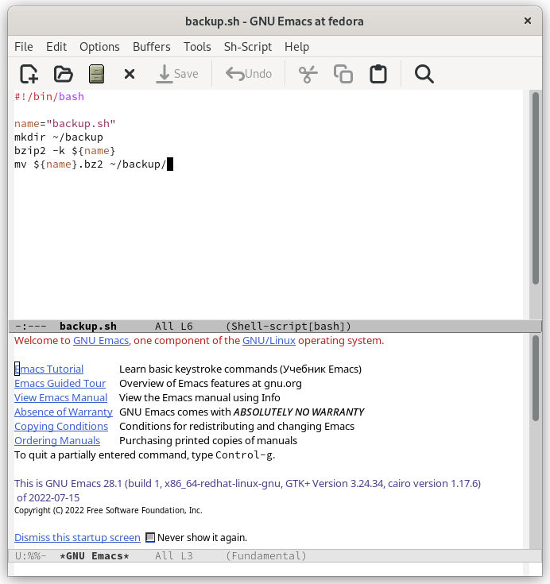
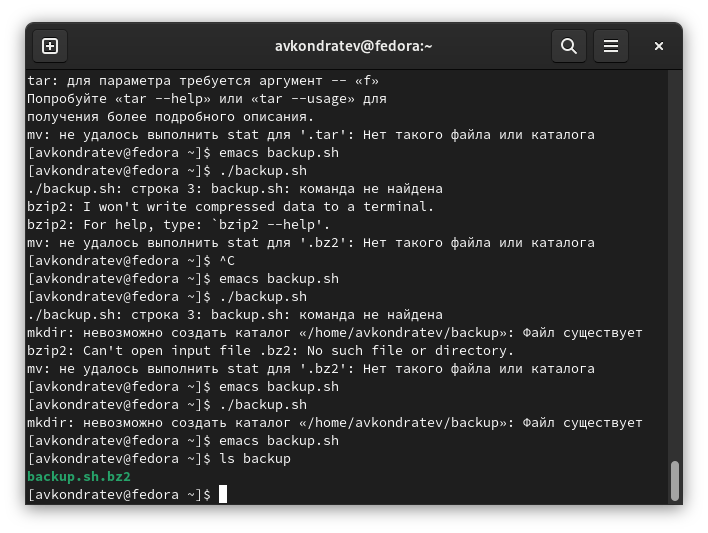
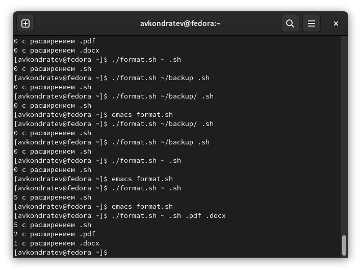

---
## Front matter
lang: ru-RU
title: "Лабораторная работа №10"
subtitle: "Дисциплина: Операционные системы"
author: Кондратьев Арсений Вячеславович
institute: Российский университет дружбы народов, Москва, Россия
date: 23.09.2022

## i18n babel
babel-lang: russian
babel-otherlangs: english

## Formatting pdf
toc: false
toc-title: Содержание
slide_level: 2
aspectratio: 169
section-titles: true
theme: metropolis
header-includes:
 - \metroset{progressbar=frametitle,sectionpage=progressbar,numbering=fraction}
 - '\makeatletter'
 - '\beamer@ignorenonframefalse'
 - '\makeatother'
---

# Цель работы

Изучить основы программирования в оболочке ОС UNIX/Linux. Научиться писать
небольшие командные файлы..

# Выполнение лабораторной работы

1.	Написал скрипт, который при запуске будет делать резервную копию самого себя в другую директорию backup в домашнем каталоге. Для этого использовал bzip2(рис.[-@fig:001])

 { #fig:001 width=30% }
 
## Выполнение лабораторной работы
 
 Результат(рис.[-@fig:002])
 
 { #fig:002 width=40% }
 
## Выполнение лабораторной работы

 2. Написал скрипт, который последовательно распечатывает значения всех переданных аргументов(рис.[-@fig:003])

 { #fig:003 width=30% }
 
## Выполнение лабораторной работы
 
 Результат(рис.[-@fig:004])
 
 { #fig:004 width=40% }
 
## Выполнение лабораторной работы

3. Написал аналог команды ls, чтобы он выдавал информацию о нужном каталоге
и выводил информацию о возможностях доступа к файлам этого каталога(рис.[-@fig:005])

{ #fig:005 width=30% }

## Выполнение лабораторной работы

Результат(рис.[-@fig:006])

{ #fig:006 width=40% }
 
## Выполнение лабораторной работы

4. Написал командный файл, который получает в качестве аргумента командной строки
формат файла (.txt, .doc, .jpg, .pdf и т.д.) и вычисляет количество таких файлов
в указанной директории. Путь к директории также передаётся в виде аргумента командной строки(рис.[-@fig:007])

{ #fig:007 width=30% }
 
## Выполнение лабораторной работы

Результат(рис.[-@fig:008])

{ #fig:008 width=40% }

# Вывод

Я изучил основы программирования в оболочке ОС UNIX/Linux. Научился писать
небольшие командные файлы.

