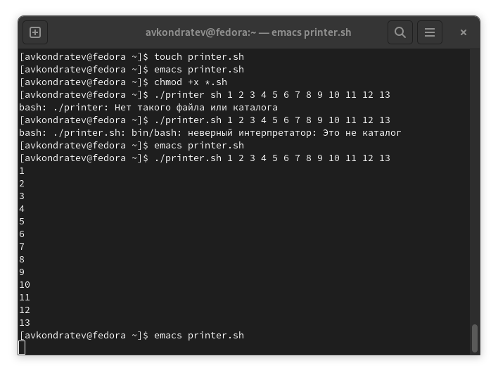
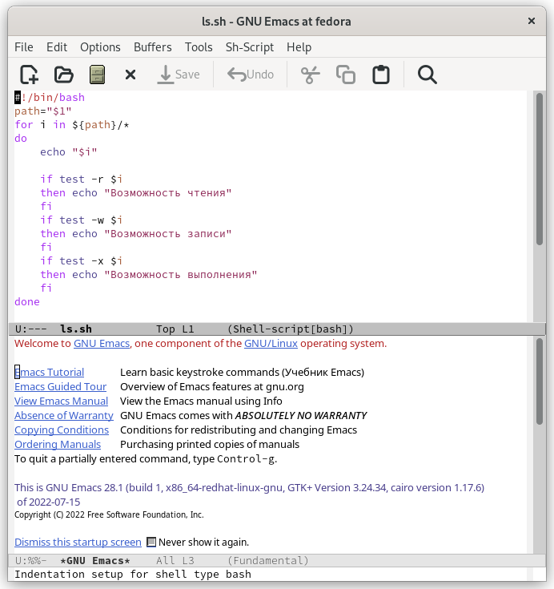
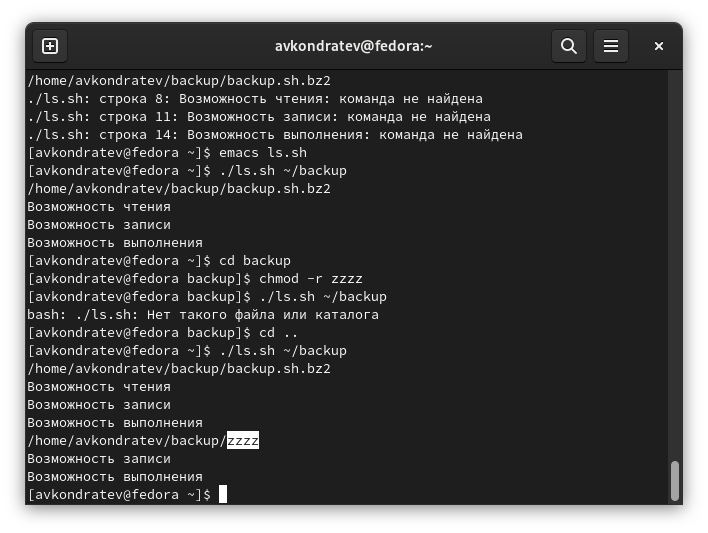
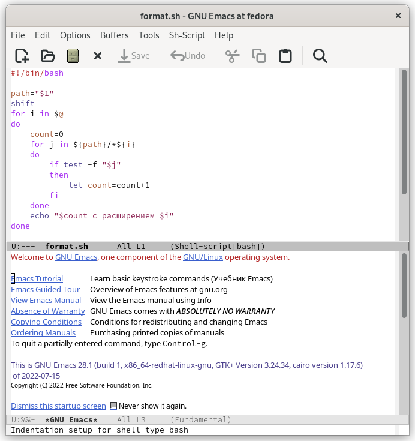

---
## Front matter
lang: ru-RU
title: "Лабораторная работа №10"
subtitle: "Дисциплина: Операционные системы"
author: "Кондратьев Арсений Вячеславович"
institute: "Российский университет дружбы народов, Москва, Россия"
date: 23.09.2022

## Generic otions
lang: ru-RU
toc-title: "Содержание"

## Bibliography
bibliography: bib/cite.bib
csl: pandoc/csl/gost-r-7-0-5-2008-numeric.csl

## Pdf output format
toc: true # Table of contents
toc-depth: 2

fontsize: 12pt
linestretch: 1.5
papersize: a4
documentclass: scrreprt
## I18n polyglossia
polyglossia-lang:
  name: russian
  options:
	- spelling=modern
	- babelshorthands=true
polyglossia-otherlangs:
  name: english
## I18n babel
babel-lang: russian
babel-otherlangs: english
## Fonts
mainfont: PT Serif
romanfont: PT Serif
sansfont: PT Sans
monofont: PT Mono
mainfontoptions: Ligatures=TeX
romanfontoptions: Ligatures=TeX
sansfontoptions: Ligatures=TeX,Scale=MatchLowercase
monofontoptions: Scale=MatchLowercase,Scale=0.9
## Biblatex
biblatex: true
biblio-style: "gost-numeric"
biblatexoptions:
  - parentracker=true
  - backend=biber
  - hyperref=auto
  - language=auto
  - autolang=other*
  - citestyle=gost-numeric


## Misc options
indent: true
header-includes:
  - \usepackage{indentfirst}
  - \usepackage{float} # keep figures where there are in the text
  - \floatplacement{figure}{H} # keep figures where there are in the text
---

# Цель работы

Изучить основы программирования в оболочке ОС UNIX/Linux. Научиться писать
небольшие командные файлы.

# Теоретическое введение

mark - присваивает значение строки символов

let - является показателем того, что последующие аргументы представляют собой выражение, подлежащее вычислению

break - прерывание циклов

# Выполнение лабораторной работы

1.	Написал скрипт, который при запуске будет делать резервную копию самого себя в другую директорию backup в домашнем каталоге. Для этого использовал bzip2(рис.[-@fig:001])(рис.[-@fig:002])

Создал файл для скрипта backup.sh и дал права на исполнение  
```bash
touch backup.sh
chmod +x *.sh
```

Присвоил переменной название файла скрипта, затем создал каталог, в которую требуется сохранить резервную копию, заархивировал файл скрипта с помощью bzip2 и переместил архив в каталог backup  
```bash
name="bachup.sh"
mkdir ~/backup
bzip2 -k ${name}
mv ${name}.bz2 ~/backup/
```

 { #fig:001 width=70% }
 
 { #fig:002 width=70% }
 
2. Написал скрипт, который последовательно распечатывает значения всех переданных аргументов(рис.[-@fig:003])(рис.[-@fig:004])

Циклом for прошелся по переданным аргументам и с помощью echo вывел их  
```bash
for i in $@
do echo $i
done
```
 
 { #fig:003 width=70% }
 
 { #fig:004 width=70% }
 
3. Написал аналог команды ls, чтобы он выдавал информацию о нужном каталоге
и выводил информацию о возможностях доступа к файлам этого каталога(рис.[-@fig:005])(рис.[-@fig:006])

Присвоил переменной path путь до каталога, циклом for прошелся по всем файлам в этом каталоге и вывел информацию о правах с помощью условного оператора и test  
```bash
path="$1"
for i in ${path}/*
do
    echo "$i"

    if test -r $i
    then echo "Возможность чтения"
    fi
    if test -w $i
    then echo "Возможность записи"
    fi
    if test -x $i
    then echo "Возможность выполнения"
    fi
done
```

{ #fig:005 width=70% }

{ #fig:006 width=70% }
  
4. Написал командный файл, который получает в качестве аргумента командной строки
формат файла (.txt, .doc, .jpg, .pdf и т.д.) и вычисляет количество таких файлов
в указанной директории. Путь к директории также передаётся в виде аргумента командной строки(рис.[-@fig:007])(рис.[-@fig:008])

Передал в path путь до каталога, сделал сдвиг с помощью shift, чтобы не рассматривать путь как файл. Циклом for прошелся по аргументам(искомые форматы), инициализировал счетчик, еще одним циклом прошелся по файлам каталога, подставляя под регулярное выражение формат из первого цикла. Если файл существует, то счетчик увеличиваем на 1. В конце каждого внешнего цикла выводим количество найденных файлов  
``` bash
path="$1"
shift
for i in $@
do
    count=0
    for j in ${path}/*${i}
    do
	if test -f "$j"
	then
	    let count=count+1
	fi
    done
    echo "$count c расширением $i"
done
```

{ #fig:007 width=70% }
 
{ #fig:008 width=70% }
 
# Выводы

Я изучил основы программирования в оболочке ОС UNIX/Linux. Научился писать
небольшие командные файлы.

# Контрольные вопросы

1. Командный процессор (командная оболочка, интерпретатор команд shell) — это программа, позволяющая пользователю взаимодействовать с операционной системой
компьютера.  
-Оболочка Борна (Bourne shell или sh) — стандартная командная оболочка UNIX/Linux,
содержащая базовый, но при этом полный набор функций;  
-С-оболочка (или csh) — надстройка на оболочкой Борна, использующая С-подобный
синтаксис команд с возможностью сохранения истории выполнения команд  
-BASH — сокращение от Bourne Again Shell (опять оболочка Борна), в основе своей совмещает свойства оболочек С и Корна  

2. POSIX (Portable Operating System Interface for Computer Environments) — набор стандартов описания интерфейсов взаимодействия операционной системы и прикладных программ.

3. Переменные - с помощью команды mark  
Массивы - с помощью команды set

4. Команда read позволяет читать значения переменных со стандартного ввода  
Команда let является показателем того, что последующие аргументы представляют собой выражение, подлежащее вычислению

5. Сложение(+), умножение(*), деление(/), остаток от деления(%), вычитание(-)

6. Для облегчения программирования можно записывать условия оболочки bash в двойные
скобки. Можно присваивать результаты условных выражений переменным, также как и использовать результаты арифметических вычислений в качестве условий

7. HOME — имя домашнего каталога пользователя. Если команда cd вводится без аргументов, то происходит переход в каталог, указанный в этой переменной.  
IFS — последовательность символов, являющихся разделителями в командной строке,
например, пробел, табуляция и перевод строки (new line).  
MAIL — командный процессор каждый раз перед выводом на экран промптера проверяет содержимое файла, имя которого указано в этой переменной, и если содержимое
этого файла изменилось с момента последнего ввода из него, то перед тем как вывести
на терминал промптер, командный процессор выводит на терминал сообщение You
have mail (у Вас есть почта).  
TERM — тип используемого терминала.  
LOGNAME — содержит регистрационное имя пользователя, которое устанавливается
автоматически при входе в систему.

8. Метасимволы - это символы, которые имеют для командного процессора специальный смысл. Снятие специального смысла с метасимвола называется экранированием метасимвола

9. С помощью обратного слэша(\\)

10. С помощью команды touch, указывая формат sh. Чтобы запустить, нужно перед названием файла в консоли написать (./)

11. С помощью function имя_функции\{тело функции\}

12. С помощью команды test, которой можно проверить опцию -d для каталога или -f для файла

13. set - создание массива  
unset - изъять переменную из программы  
typeset - объявление переменной с возможностью задать ее тип

14. В консоли через пробел после названия. Обращение к ним происходит с помощью $

15. – $* — отображается вся командная строка или параметры оболочки;  
– $? — код завершения последней выполненной команды;  
– $$ — уникальный идентификатор процесса, в рамках которого выполняется командный процессор;  
– $! — номер процесса, в рамках которого выполняется последняя вызванная на выполнение в командном режиме команда;  
– $- — значение флагов командного процессора;  
– ${#*} — возвращает целое число — количество слов, которые были результатом $*;  
– ${#name} — возвращает целое значение длины строки в переменной name;  
– ${name:-value} — если значение переменной name не определено, то оно будет заменено на указанное value  

::: {#refs}
:::
