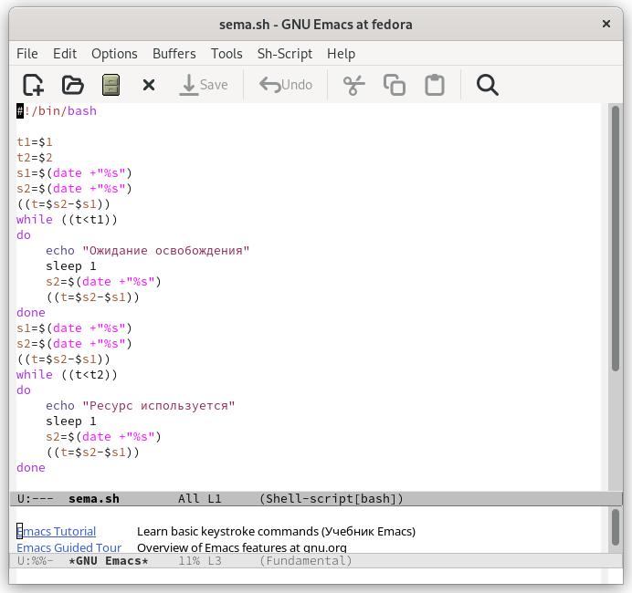
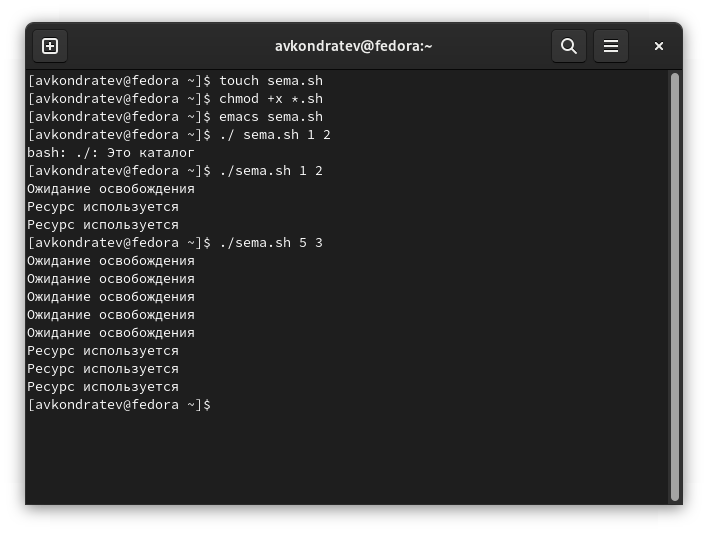
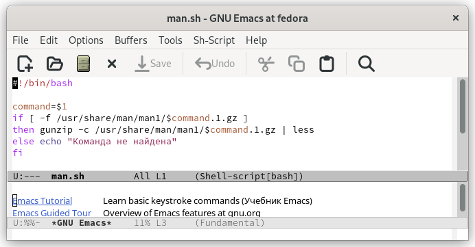
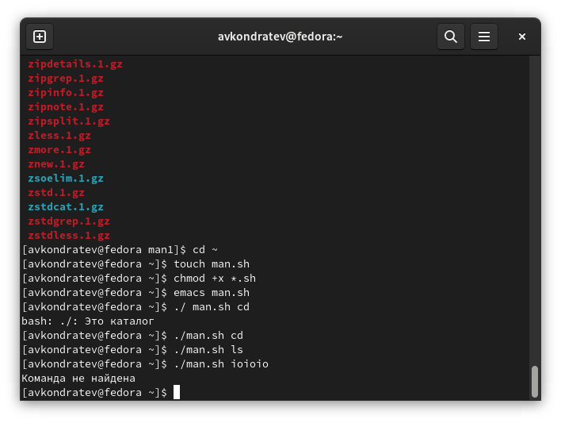
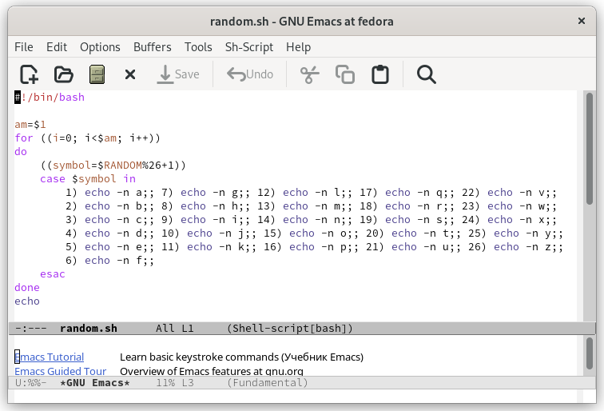
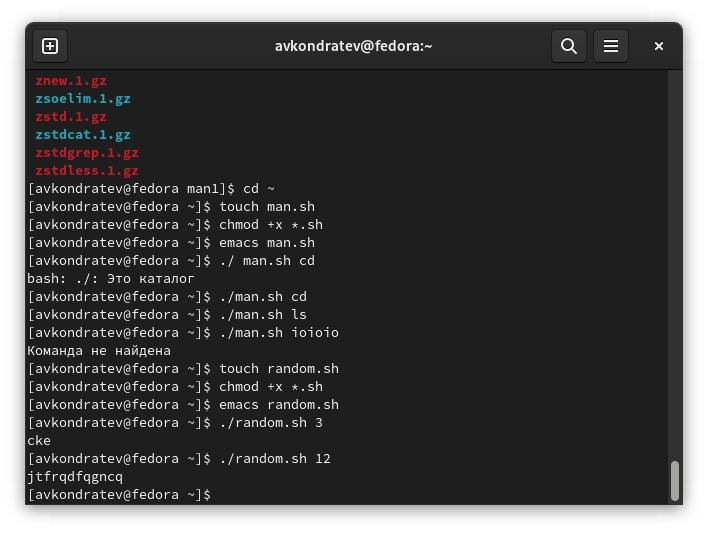

---
## Front matter
lang: ru-RU
title: "Лабораторная работа №12"
subtitle: "Дисциплина: Операционные системы"
author: "Кондратьев Арсений Вячеславович"
institute: "Российский университет дружбы народов, Москва, Россия"
date: 24.09.2022

## Generic otions
lang: ru-RU
toc-title: "Содержание"

## Bibliography
bibliography: bib/cite.bib
csl: pandoc/csl/gost-r-7-0-5-2008-numeric.csl

## Pdf output format
toc: true # Table of contents
toc-depth: 2

fontsize: 12pt
linestretch: 1.5
papersize: a4
documentclass: scrreprt
## I18n polyglossia
polyglossia-lang:
  name: russian
  options:
	- spelling=modern
	- babelshorthands=true
polyglossia-otherlangs:
  name: english
## I18n babel
babel-lang: russian
babel-otherlangs: english
## Fonts
mainfont: PT Serif
romanfont: PT Serif
sansfont: PT Sans
monofont: PT Mono
mainfontoptions: Ligatures=TeX
romanfontoptions: Ligatures=TeX
sansfontoptions: Ligatures=TeX,Scale=MatchLowercase
monofontoptions: Scale=MatchLowercase,Scale=0.9
## Biblatex
biblatex: true
biblio-style: "gost-numeric"
biblatexoptions:
  - parentracker=true
  - backend=biber
  - hyperref=auto
  - language=auto
  - autolang=other*
  - citestyle=gost-numeric


## Misc options
indent: true
header-includes:
  - \usepackage{indentfirst}
  - \usepackage{float} # keep figures where there are in the text
  - \floatplacement{figure}{H} # keep figures where there are in the text
---

# Цель работы

Изучить основы программирования в оболочке ОС UNIX. Научиться писать более
сложные командные файлы с использованием логических управляющих конструкций
и циклов.

# Теоретическое введение

mark - присваивает значение строки символов

let - является показателем того, что последующие аргументы представляют собой выражение, подлежащее вычислению

break - прерывание циклов

# Выполнение лабораторной работы

1.	Написал командный файл, реализующий упрощённый механизм семафоров

Написал скрипт(рис.[-@fig:001])  
```bash
#!/bin/bash

t1=$1
t2=$2
s1=$(date +"%s")
s2=$(date +"%s")
((t=$s2-$s1))
while ((t<t1))
do
    echo "Ожидание освобождения"
    sleep 1
    s2=$(date +"%s")
    ((t=$s2-$s1))
done
s1=$(date +"%s")
s2=$(date +"%s")
((t=$s2-$s1))
while ((t<t2))
do
    echo "Ресурс используется"
    sleep 1
    s2=$(date +"%s")
    ((t=$s2-$s1))
done
```

{ #fig:001 width=70% }
 
  В результате с некоторым интервалом получаем сообщения об освобождении, а затем об использовании(рис.[-@fig:002]) 
 
{ #fig:002 width=70% }
 
2. Реализовал команду man с помощью командного файла
 
 Написал скрипт, который разархивирует информацию об введенной команде(рис.[-@fig:003])  
```bash
 #!/bin/bash

command=$1
if [ -f /usr/share/man/man1/$command.1.gz ]
then gunzip -c /usr/share/man/man1/$command.1.gz | less
else echo "Команда не найдена"
fi
```
 
 { #fig:003 width=70% }
 
  В результате получаем описание введенной команды(рис.[-@fig:004]) 
 
 { #fig:004 width=70% }
 
3. Используя встроенную переменную $RANDOM, написал командный файл, генерирующий случайную последовательность букв латинского алфавита

Написал скрипт, который генерирует числа от 1 до 26 и в соответствии с этим числом выводит символ(рис.[-@fig:005])  
```bash
#!/bin/bash

am=$1
for ((i=0; i<$am; i++))
do
    ((symbol=$RANDOM%26+1))
    case $symbol in
	1) echo -n a;; 7) echo -n g;; 12) echo -n l;; 17) echo -n q;; 22) echo -n v;;
	2) echo -n b;; 8) echo -n h;; 13) echo -n m;; 18) echo -n r;; 23) echo -n w;;
	3) echo -n c;; 9) echo -n i;; 14) echo -n n;; 19) echo -n s;; 24) echo -n x;;
	4) echo -n d;; 10) echo -n j;; 15) echo -n o;; 20) echo -n t;; 25) echo -n y;;
	5) echo -n e;; 11) echo -n k;; 16) echo -n p;; 21) echo -n u;; 26) echo -n z;;
	6) echo -n f;;
    esac
done
echo
```

{ #fig:005 width=70% }

 В результате получаем случайную последовательность символов(рис.[-@fig:008])  

{ #fig:006 width=70% }
 
# Выводы

Я изучил основы программирования в оболочке ОС UNIX. Научился писать более
сложные командные файлы с использованием логических управляющих конструкций
и циклов.


# Контрольные вопросы

 1. После открывающей и перед закрывающей квадратными скобками нужно поставить пробел  
 2. Присвоить двум переменным значения этих строк и в кавычках подряд вывести эти переменные ("$str1$str2")  
 3. Команда seq выводит последовательность целых или действительных чисел, подходящую для передачи в другие программы.  
 Ее можно реализовать с помощью циклов, например  
 seq 5  
 for ((i=1; i<6; i++))  
 4. 3  
 5. Zsh более интерактивный и настраиваемый, чем Bash. У Zsh есть поддержка с плавающей точкой, которой нет у Bash. В Zsh поддерживаются структуры хеш-данных, которых нет в Bash. Функции вызова в Bash лучше по сравнению с Zsh  
 6. Верен  
 7. Плюсы:  
 Bash позволяет писать Shell-сценарии с минимальной грамматикой  
 Bash поддерживает процессы нативно  
 Минусы:  
 Bash — это командный язык, а не язык программирования общего назначения. Поэтому с усложнением логики вашего автоматизированного сценария он становится более запутанным и менее читаемым  
 У Bash нет стандартного API, однако он поставляется с простыми встроенными функциями
 

::: {#refs}
:::
