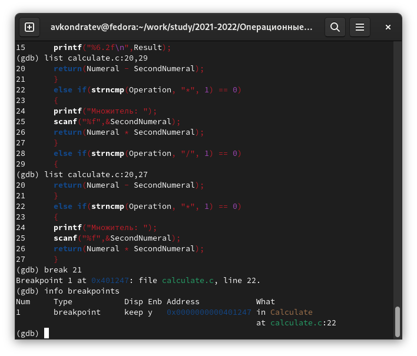

---
## Front matter
lang: ru-RU
title: "Лабораторная работа №13"
subtitle: "Дисциплина: Операционные системы"
author: Кондратьев Арсений Вячеславович
institute: Российский университет дружбы народов, Москва, Россия
date: 25.09.2022

## i18n babel
babel-lang: russian
babel-otherlangs: english

## Formatting pdf
toc: false
toc-title: Содержание
slide_level: 2
aspectratio: 169
section-titles: true
theme: metropolis
header-includes:
 - \metroset{progressbar=frametitle,sectionpage=progressbar,numbering=fraction}
 - '\makeatletter'
 - '\beamer@ignorenonframefalse'
 - '\makeatother'
---

# Цель работы

Приобрести простейшие навыки разработки, анализа, тестирования и отладки приложений в ОС типа UNIX/Linux на примере создания на языке программирования
С калькулятора с простейшими функциями

# Выполнение лабораторной работы

1.	Выполнил компиляцию программы посредством gcc(рис.[-@fig:001])  

 { #fig:001 width=40% }
  
## Выполнение лабораторной работы

2. Создал Makefile в котором дописал опцию -g в СFLAGS для корректной компиляции объектных файлов и использовал переменную СС в которую помещен компилятор. Он необходим для автоматической компиляции calculate.c, main.c и объединения в один исполняемый файл calcul. Сlean нужна для автоматического удаления файлов. Переменная CFLAGS отвечает за опции. Переменная LIBS отвечает за опции для объединения.(рис.[-@fig:002])  

{ #fig:002 width=30% }
  
## Выполнение лабораторной работы

3. Запустил отладчик GDB, загрузив в него программу для отладки(рис.[-@fig:003])

{ #fig:003 width=40% }

## Выполнение лабораторной работы

4. Установил точку останова в файле calculate.c на строке номер 21 и вывел информацию о точках останова с помощью info breakpoints(рис.[-@fig:004])

{ #fig:004 width=40% }

## Выполнение лабораторной работы

5. Убедился, что программа останавливается в момент точки останова, с помощью print Numeral выяснил что эта переменная равна 5 на тот момент и сравнил результат с командой display Numeral(рис.[-@fig:005])

{ #fig:005 width=40% }

# Вывод

Я приобрел простейшие навыки разработки, анализа, тестирования и отладки приложений в ОС типа UNIX/Linux на примере создания на языке программирования
С калькулятора с простейшими функциями

