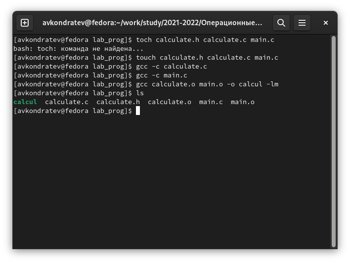
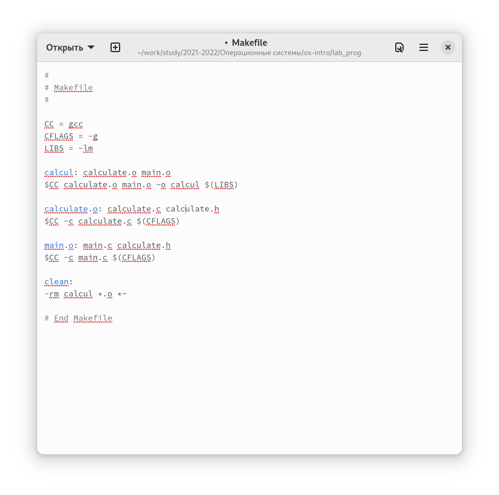
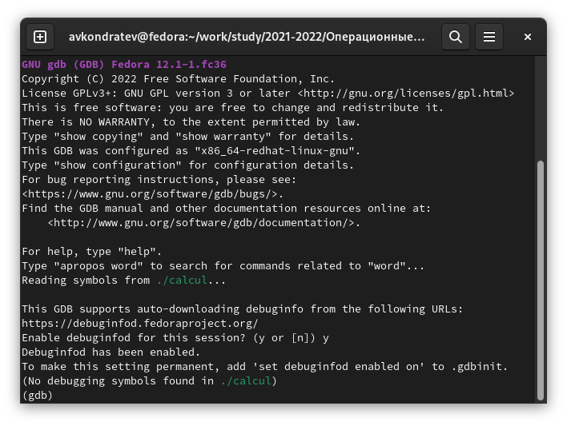
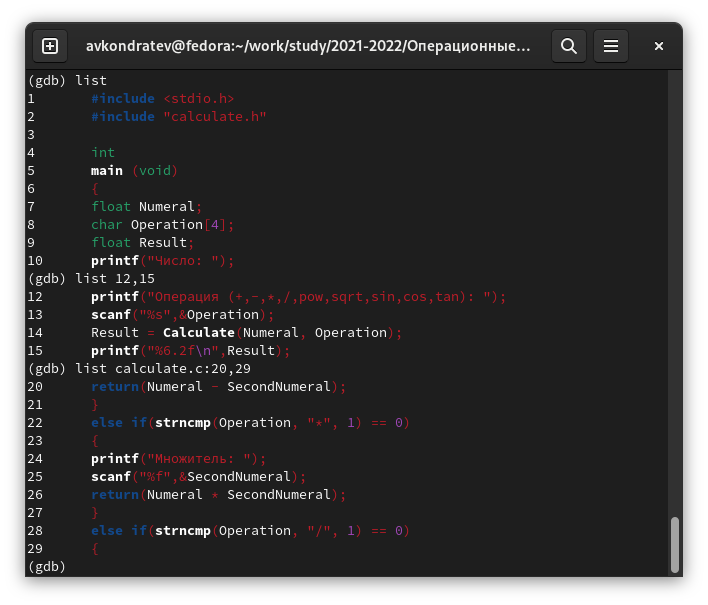
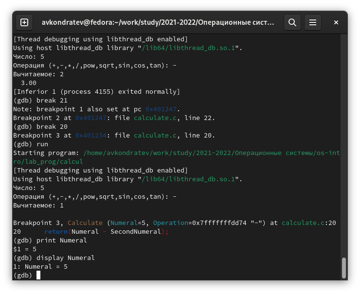
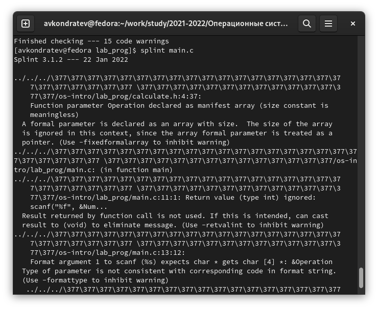

---
## Front matter
lang: ru-RU
title: "Лабораторная работа №13"
subtitle: "Дисциплина: Операционные системы"
author: "Кондратьев Арсений Вячеславович"
institute: "Российский университет дружбы народов, Москва, Россия"
date: 25.09.2022

## Generic otions
lang: ru-RU
toc-title: "Содержание"

## Bibliography
bibliography: bib/cite.bib
csl: pandoc/csl/gost-r-7-0-5-2008-numeric.csl

## Pdf output format
toc: true # Table of contents
toc-depth: 2

fontsize: 12pt
linestretch: 1.5
papersize: a4
documentclass: scrreprt
## I18n polyglossia
polyglossia-lang:
  name: russian
  options:
	- spelling=modern
	- babelshorthands=true
polyglossia-otherlangs:
  name: english
## I18n babel
babel-lang: russian
babel-otherlangs: english
## Fonts
mainfont: PT Serif
romanfont: PT Serif
sansfont: PT Sans
monofont: PT Mono
mainfontoptions: Ligatures=TeX
romanfontoptions: Ligatures=TeX
sansfontoptions: Ligatures=TeX,Scale=MatchLowercase
monofontoptions: Scale=MatchLowercase,Scale=0.9
## Biblatex
biblatex: true
biblio-style: "gost-numeric"
biblatexoptions:
  - parentracker=true
  - backend=biber
  - hyperref=auto
  - language=auto
  - autolang=other*
  - citestyle=gost-numeric


## Misc options
indent: true
header-includes:
  - \usepackage{indentfirst}
  - \usepackage{float} # keep figures where there are in the text
  - \floatplacement{figure}{H} # keep figures where there are in the text
---

# Цель работы

Приобрести простейшие навыки разработки, анализа, тестирования и отладки приложений в ОС типа UNIX/Linux на примере создания на языке программирования
С калькулятора с простейшими функциями

# Теоретическое введение

Процесс разработки программного обеспечения обычно разделяется на следующие
этапы:  
– планирование, включающее сбор и анализ требований к функционалу и другим характеристикам разрабатываемого приложения;  
– проектирование, включающее в себя разработку базовых алгоритмов и спецификаций,
определение языка программирования;  
– непосредственная разработка приложения:  
– кодирование — по сути создание исходного текста программы (возможно
в нескольких вариантах);  
– анализ разработанного кода;  
– сборка, компиляция и разработка исполняемого модуля;  
– тестирование и отладка, сохранение произведённых изменений;  
– документирование.  

# Выполнение лабораторной работы

1.	Создал подкаталог /lab_prog в котором создал файлы: calculate.h, calculate.c, main.c и написал в них реализацию простейшего калькулятора.(рис.[-@fig:001])

{ #fig:001 width=70% }
 
2. Выполнил компиляцию программы посредством gcc(рис.[-@fig:002])  

```bash
gcc -c calculate.c -g
2 gcc -c main.c -g
3 gcc calculate.o main.o -o calcul -lm
```

 { #fig:002 width=70% }
 
3. Создал Makefile в котором дописал опцию -g в СFLAGS для корректной компиляции объектных файлов и использовал переменную СС в которую помещен компилятор. Он необходим для автоматической компиляции calculate.c, main.c и объединения в один исполняемый файл calcul. Сlean нужна для автоматического удаления файлов. Переменная CFLAGS отвечает за опции. Переменная LIBS отвечает за опции для объединения.(рис.[-@fig:003])  

{ #fig:003 width=70% }

4. Запустил отладчик GDB, загрузив в него программу для отладки(рис.[-@fig:004])

{ #fig:004 width=70% }

5. Запустил программу внутри отладчика(рис.[-@fig:005])

{ #fig:005 width=70% }

6. Использовал команду list для постраничного просмотра кода, затем просмотрел код с 12 по 15 строку, затем просмотрел определенные строки не основного файла(рис.[-@fig:006])

{ #fig:006 width=70% }

7. Установил точку останова в файле calculate.c на строке номер 21 и вывел информацию о точках останова с помощью info breakpoints(рис.[-@fig:007])

{ #fig:007 width=70% }

8. Убедился, что программа останавливается в момент точки останова, с помощью print Numeral выяснил что эта переменная равна 5 на тот момент и сравнил результат с командой display Numeral(рис.[-@fig:008])

{ #fig:008 width=70% }

9. Убрал точки останова(рис.[-@fig:009])

{ #fig:009 width=70% }

10. С помощью утилиты splint проанализировал коды файлов calculate.c
и main.c(рис.[-@fig:010])

{ #fig:010 width=70% }

# Выводы

Я приобрел простейшие навыки разработки, анализа, тестирования и отладки приложений в ОС типа UNIX/Linux на примере создания на языке программирования
С калькулятора с простейшими функциями


# Контрольные вопросы

 1. С помощью справочной команды man
 
 2.   
 – планирование, включающее сбор и анализ требований к функционалу и другим характеристикам разрабатываемого приложения;  
– проектирование, включающее в себя разработку базовых алгоритмов и спецификаций,
определение языка программирования;  
– непосредственная разработка приложения:  
– кодирование — по сути создание исходного текста программы (возможно
в нескольких вариантах);  
– анализ разработанного кода;  
– сборка, компиляция и разработка исполняемого модуля;  
– тестирование и отладка, сохранение произведённых изменений;  
– документирование.  

3. Суффикс - это расширение  
gcc -c main.c  
Таким образом, gcc по расширению (суффиксу) .c распознает тип файла для компиляции и формирует объектный модуль — файл с расширением .o

4. Для запуска программ, написанных на других языках программирования

5. Для исполнения мэйкфайлов  
6. Он состоит из списка зависимостей и команд, которые нужно выполнить  

7. Во время работы над кодом программы программист неизбежно сталкивается с появлением ошибок в ней. Использование отладчика для поиска и устранения ошибок в программе существенно облегчает жизнь программиста. В комплект программ GNU для ОС типа UNIX входит отладчик GDB (GNU Debugger).
Для использования GDB необходимо скомпилировать анализируемый код программы таким образом, чтобы отладочная информация содержалась в результирующем бинарном файле. Для этого следует воспользоваться опцией -g компилятора gcc:
gcc -c file.c -g
После этого для начала работы с gdb необходимо в командной строке ввести одноимённую команду, указав в качестве аргумента анализируемый бинарный файл:
gdb file.o

8.   
– backtrace – выводит весь путь к текущей точке останова, то есть
названия всех функций, начиная от main(); иными словами, выводит
весь стек функций;  
– break – устанавливает точку останова; параметром может быть
номер строки или название функции;  
– clear – удаляет все точки останова на текущем уровне стека (то есть
в текущей функции);  
– continue – продолжает выполнение программы от текущей точки
до конца;  
– delete – удаляет точку останова или контрольное выражение;  
– display – добавляет выражение в список выражений, значения кото-
рых отображаются каждый раз при остановке программы;  
– finish – выполняет программу до выхода из текущей функции; отоб-
ражает возвращаемое значение,если такое имеется;  
– info breakpoints – выводит список всех имеющихся точек останова;  
– info watchpoints – выводит список всех имеющихся контрольных
выражений;  
– list – выводит исходный код; в качестве параметра передаются
название файла исходного кода, затем, через двоеточие, номер
начальной и конечной строки;  
– next – пошаговое выполнение программы, но, в отличие от команды
step, не выполняет пошагово вызываемые функции;  
– print – выводит значение какого-либо выражения (выражение пере-
даётся в качестве параметра);  
– run – запускает программу на выполнение;  
– set – устанавливает новое значение переменной  
– step – пошаговое выполнение программы;  
– watch – устанавливает контрольное выражение

9. Просмотрел код программы, поставил точку останова, запустил программу, на точке останова узнал значение переменной, закончил программу

10. Синтаксические ошибки отсутствовали

11. cscope − исследование функций, содержащихся в программе,
lint − критическая проверка программ, написанных на языке Си

12. Splint анализирует программный код, проверяет корректность задания аргументов использованных в программе функций и типов возвращаемых значений.
 

::: {#refs}
:::
