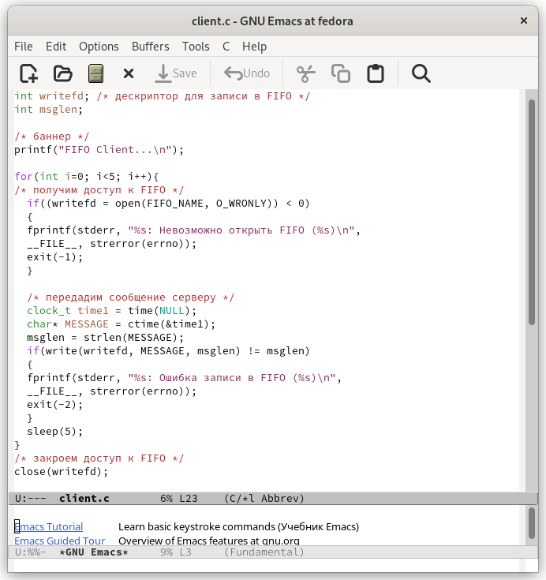
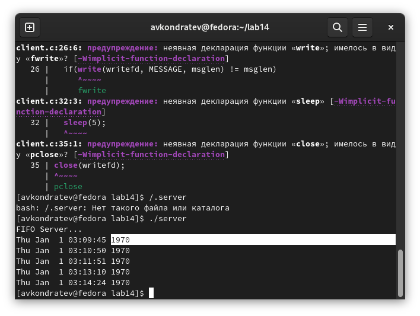
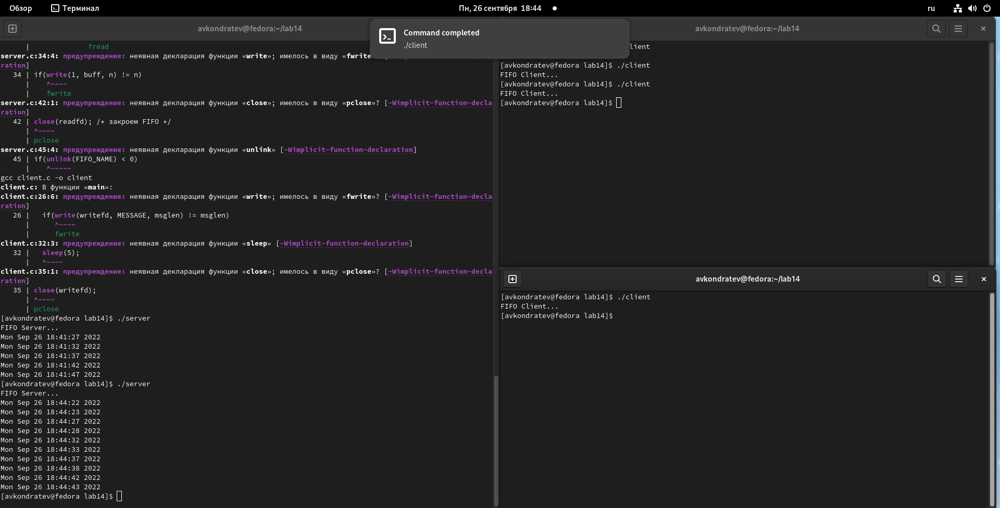

---
## Front matter
lang: ru-RU
title: "Лабораторная работа №14"
subtitle: "Дисциплина: Операционные системы"
author: Кондратьев Арсений Вячеславович
institute: Российский университет дружбы народов, Москва, Россия
date: 26.09.2022

## i18n babel
babel-lang: russian
babel-otherlangs: english

## Formatting pdf
toc: false
toc-title: Содержание
slide_level: 2
aspectratio: 169
section-titles: true
theme: metropolis
header-includes:
 - \metroset{progressbar=frametitle,sectionpage=progressbar,numbering=fraction}
 - '\makeatletter'
 - '\beamer@ignorenonframefalse'
 - '\makeatother'
---

# Цель работы

Приобретение практических навыков работы с именованными каналами.

# Выполнение лабораторной работы

1.	Чтобы сервер работал не бесконечно, а прекращал работу через некоторое время, я добавил в цикл while в файле сервера доп условие, чтобы разница между текущим и стартовым временем была меньше 30(рис.[-@fig:001])

{ #fig:001 width=30% }
  
## Выполнение лабораторной работы

2. Написал цикл for, чтобы клиент передавал серверу текущее время, и с помощью команды sleep() установил интервал 5 сек. И с помощью фцнкции time(NULL) передавал в переменную текущее время, а потом передавал сообщение на сервер.(рис.[-@fig:002])

 { #fig:002 width=30% }
  
## Выполнение лабораторной работы

Мной было замечено, что функция clock неверно вычисляет время(рис.[-@fig:003]), но она корректно считает секунды, поэтому я ее использовал для завершения работы сервера
 
 { #fig:003 width=40% }

## Выполнение лабораторной работы

Результат: клиент выводит на сервер текущее время с интервалом 5 сек, а сервер завершает работу после 30 сек(рис.[-@fig:004])
 
 { #fig:004 width=40% }

## Выполнение лабораторной работы

3. Проверил работу 2-х клиентов. Можно заметить, как каждый отправляет на сервер текущее время с собственным интервалом 5 сек(рис.[-@fig:005])  

{ #fig:005 width=70% }

# Вывод

Я приобрел практические навыки работы с именованными каналами.

