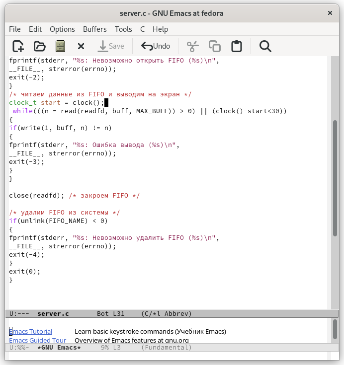

---
## Front matter
lang: ru-RU
title: "Лабораторная работа №14"
subtitle: "Дисциплина: Операционные системы"
author: "Кондратьев Арсений Вячеславович"
institute: "Российский университет дружбы народов, Москва, Россия"
date: 26.09.2022

## Generic otions
lang: ru-RU
toc-title: "Содержание"

## Bibliography
bibliography: bib/cite.bib
csl: pandoc/csl/gost-r-7-0-5-2008-numeric.csl

## Pdf output format
toc: true # Table of contents
toc-depth: 2

fontsize: 12pt
linestretch: 1.5
papersize: a4
documentclass: scrreprt
## I18n polyglossia
polyglossia-lang:
  name: russian
  options:
	- spelling=modern
	- babelshorthands=true
polyglossia-otherlangs:
  name: english
## I18n babel
babel-lang: russian
babel-otherlangs: english
## Fonts
mainfont: PT Serif
romanfont: PT Serif
sansfont: PT Sans
monofont: PT Mono
mainfontoptions: Ligatures=TeX
romanfontoptions: Ligatures=TeX
sansfontoptions: Ligatures=TeX,Scale=MatchLowercase
monofontoptions: Scale=MatchLowercase,Scale=0.9
## Biblatex
biblatex: true
biblio-style: "gost-numeric"
biblatexoptions:
  - parentracker=true
  - backend=biber
  - hyperref=auto
  - language=auto
  - autolang=other*
  - citestyle=gost-numeric

## Misc options
indent: true
header-includes:
  - \usepackage{indentfirst}
  - \usepackage{float} # keep figures where there are in the text
  - \floatplacement{figure}{H} # keep figures where there are in the text
---

# Цель работы

Приобретение практических навыков работы с именованными каналами.

# Теоретическое введение

Вызов функции mkfifo() создаёт файл канала  
Файлы именованных каналов создаются функцией mkfifo  
Посылаем сообщение серверу с помощью функции write()  

# Выполнение лабораторной работы

1.	Чтобы сервер работал не бесконечно, а прекращал работу через некоторое время, я добавил в цикл while в файле сервера доп условие, чтобы разница между текущим и стартовым временем была меньше 30(рис.[-@fig:001])

{ #fig:001 width=70% }
 
2. Написал цикл for, чтобы клиент передавал серверу текущее время, и с помощью команды sleep() установил интервал 5 сек. И с помощью фцнкции time(NULL) передавал в переменную текущее время, а потом передавал сообщение на сервер.(рис.[-@fig:002])

 { #fig:002 width=70% }
 
 Мной было замечено, что функция clock неверно вычисляет время(рис.[-@fig:003]), но она корректно считает секунды, поэтому я ее использовал для завершения работы сервера
 
 { #fig:003 width=70% }
 
 Результат: клиент выводит на сервер текущее время с интервалом 5 сек, а сервер завершает работу после 30 сек(рис.[-@fig:004])
 
 { #fig:004 width=70% }
 
3. Проверил работу 2-х клиентов. Можно заметить, как каждый отправляет на сервер текущее время с собственным интервалом 5 сек(рис.[-@fig:005])  

{ #fig:005 width=70% }

# Выводы

Я приобрел практические навыки работы с именованными каналами.

# Контрольные вопросы

 1. Именованные каналы отличаются от неименованных наличием
идентификатора канала, который представлен как специальный файл  
2. Можно, с помощью объединения нескольких процессов символом |   
3. Можно, с помощью команд mkfifo или mknod  
4. int pipe(int fds[\2]);  
Единственный параметр-массив включает два файловых дескриптора — fd[\0] для чтения и fd[\1] для записи  
 5. mkfifo(FIFO_NAME, 0600); или mknod(FIFO_NAME, S_IFIFO | 0600, 0);  
 6. При чтении числа байт, меньшего чем находится в канале, возвращается требуемое число байтов, остаток сохраняется для последующих чтений. При чтении числа байт, большего чем находится в канале, возвращается доступное число байт.  
 7. Данные не будут перемешиваться  
 8. Да
 9. Write передает сообщение на сервер, записывает байты из буфера в файл. Возвращает число записанных байтов  
 EACCES − файл открыт для чтения или закрыт для записи,
EBADF − неверный handle-р файла,
ENOSPC − на устройстве нет свободного места.
Единица в вызове функции write в программе server.c означает идентификатор потока  
10. Интерпритирует номер ошибки, передаваемый в функцию

::: {#refs}
:::
