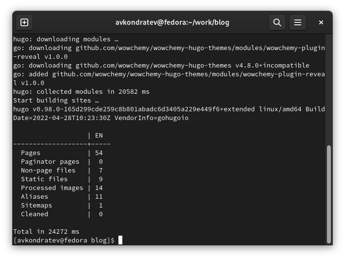
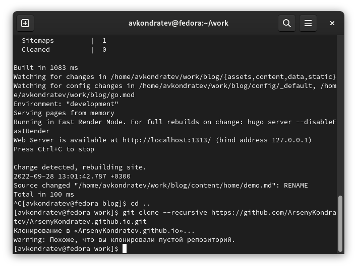
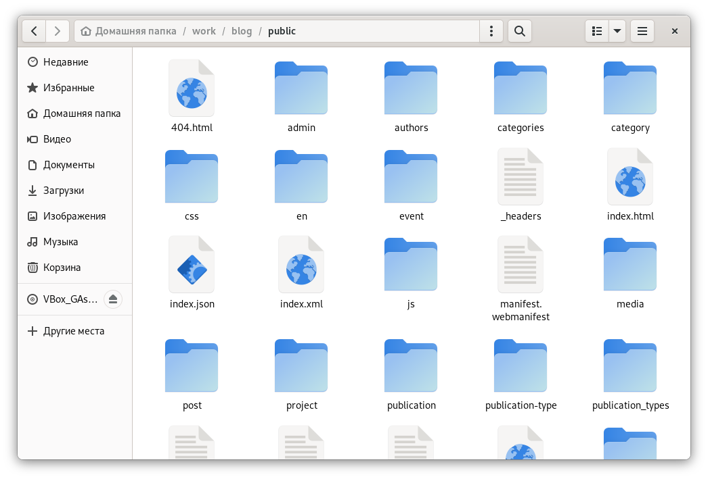

---
## Front matter
lang: ru-RU
title: "Индивидуальный проект. Шаг 1"
subtitle: "Дисциплина: Операционные системы"
author: Кондратьев Арсений Вячеславович
institute: Российский университет дружбы народов, Москва, Россия
date: 28.09.2022

## i18n babel
babel-lang: russian
babel-otherlangs: english

## Formatting pdf
toc: false
toc-title: Содержание
slide_level: 2
aspectratio: 169
section-titles: true
theme: metropolis
header-includes:
 - \metroset{progressbar=frametitle,sectionpage=progressbar,numbering=fraction}
 - '\makeatletter'
 - '\beamer@ignorenonframefalse'
 - '\makeatother'
---

# Цель работы

Размещение на Github pages заготовки для персонального сайта 

# Выполнение лабораторной работы

1.	Скачал Hugo и клонировал репозиторий в blog(рис.[-@fig:001])

{ #fig:001 width=50% }
  
## Выполнение лабораторной работы

2. Выполнил сборку сайта с помощью Hugo(рис.[-@fig:002])

 { #fig:002 width=50% }
  
## Выполнение лабораторной работы

Запустил локальный сайт с помощью Hugo server(рис.[-@fig:003])

{ #fig:003 width=50% }

## Выполнение лабораторной работы

3. Проверил работу сайта, удалив перед этим зеленый баннер(рис.[-@fig:004])  

{ #fig:004 width=50% }

## Выполнение лабораторной работы

4. Перенес сайт на репозиторий(рис.[-@fig:005])  

{ #fig:005 width=50% }

## Выполнение лабораторной работы

Клонировал репозиторий с github(рис.[-@fig:006])  

{ #fig:006 width=50% }

## Выполнение лабораторной работы

6. Еще раз выполнил Hugo после того, как закомментировал public в gitignore, и в каталоге появились файлы 

{ #fig:008 width=50% } 
{ #fig:009 width=40% }

## Выполнение лабораторной работы

7. Запушил новые файлы с сайтом на github(рис.[-@fig:010]) 

{ #fig:010 width=50% }

# Вывод

Я разместил на Github pages заготовки для персонального сайта

