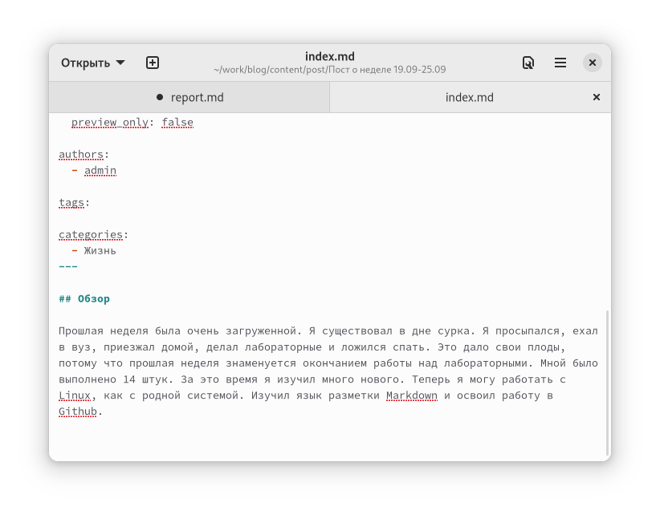
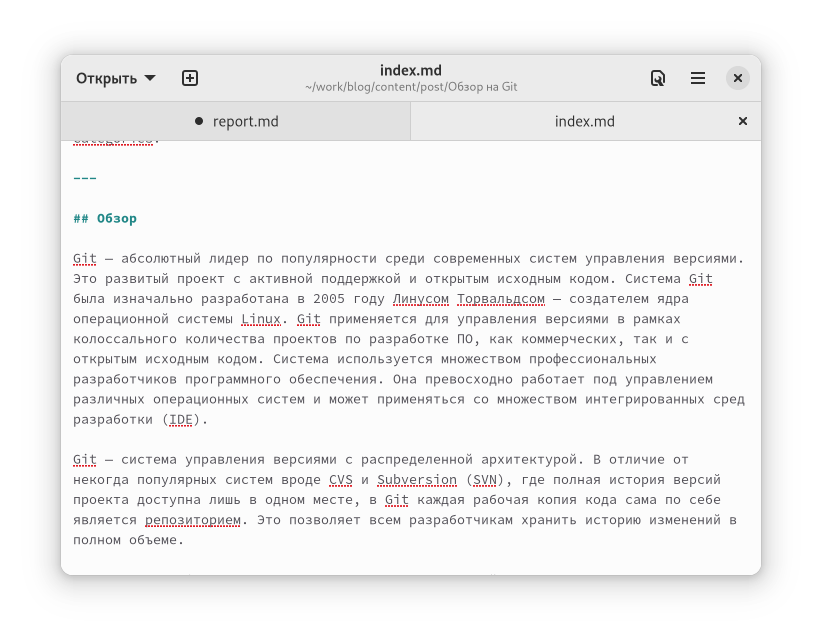
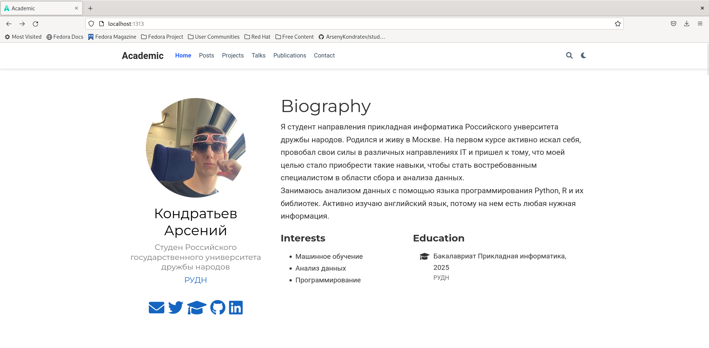
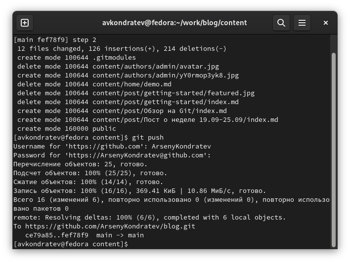

---
## Front matter
lang: ru-RU
title: "Индивидуальный проект. Шаг 2"
subtitle: "Дисциплина: Операционные системы"
author: "Кондратьев Арсений Вячеславович"
institute: "Российский университет дружбы народов, Москва, Россия"
date: 28.09.2022

## Generic otions
lang: ru-RU
toc-title: "Содержание"

## Bibliography
bibliography: bib/cite.bib
csl: pandoc/csl/gost-r-7-0-5-2008-numeric.csl

## Pdf output format
toc: true # Table of contents
toc-depth: 2

fontsize: 12pt
linestretch: 1.5
papersize: a4
documentclass: scrreprt
## I18n polyglossia
polyglossia-lang:
  name: russian
  options:
	- spelling=modern
	- babelshorthands=true
polyglossia-otherlangs:
  name: english
## I18n babel
babel-lang: russian
babel-otherlangs: english
## Fonts
mainfont: PT Serif
romanfont: PT Serif
sansfont: PT Sans
monofont: PT Mono
mainfontoptions: Ligatures=TeX
romanfontoptions: Ligatures=TeX
sansfontoptions: Ligatures=TeX,Scale=MatchLowercase
monofontoptions: Scale=MatchLowercase,Scale=0.9
## Biblatex
biblatex: true
biblio-style: "gost-numeric"
biblatexoptions:
  - parentracker=true
  - backend=biber
  - hyperref=auto
  - language=auto
  - autolang=other*
  - citestyle=gost-numeric

## Misc options
indent: true
header-includes:
  - \usepackage{indentfirst}
  - \usepackage{float} # keep figures where there are in the text
  - \floatplacement{figure}{H} # keep figures where there are in the text
---

# Цель работы

Добавить к сайту данные о себе

# Выполнение лабораторной работы

1.	Разместил фотографию, информацию об интересах и образовании.(рис.[-@fig:001])

{ #fig:001 width=70% }
 
2. Разместил биографию(рис.[-@fig:002])

 { #fig:002 width=70% }
 
3. Написал пост о прошедшей неделе(рис.[-@fig:003])  

{ #fig:003 width=70% }

4. Написал пост про Git(рис.[-@fig:004])  

{ #fig:004 width=70% }

5. Собрал сайт с помощью hugo(рис.[-@fig:005])  

{ #fig:005 width=70% }

6. Запушил изменения(рис.[-@fig:006])  

{ #fig:006 width=70% }

# Выводы

Я добавил к сайту данные о себе

::: {#refs}
:::
