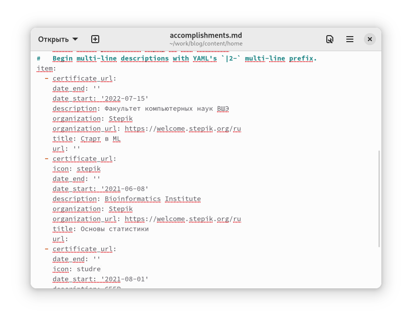
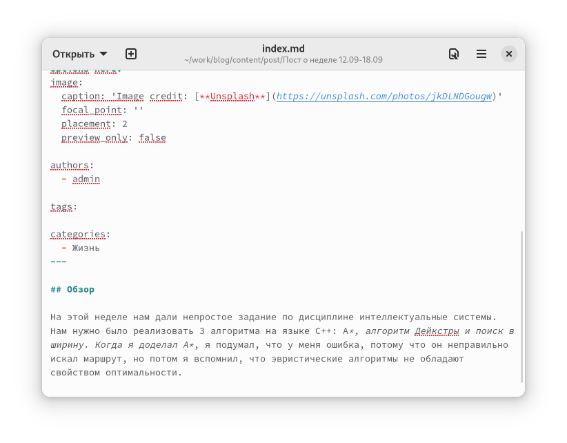
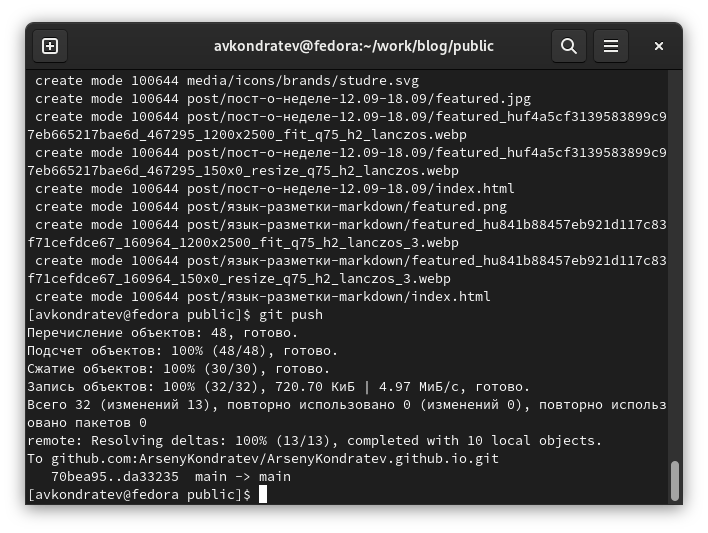

---
## Front matter
lang: ru-RU
title: "Индивидуальный проект. Шаг 3"
subtitle: "Дисциплина: Операционные системы"
author: Кондратьев Арсений Вячеславович
institute: Российский университет дружбы народов, Москва, Россия
date: 28.09.2022

## i18n babel
babel-lang: russian
babel-otherlangs: english

## Formatting pdf
toc: false
toc-title: Содержание
slide_level: 2
aspectratio: 169
section-titles: true
theme: metropolis
header-includes:
 - \metroset{progressbar=frametitle,sectionpage=progressbar,numbering=fraction}
 - '\makeatletter'
 - '\beamer@ignorenonframefalse'
 - '\makeatother'
---

# Цель работы

Добавить к сайту достижения

# Выполнение лабораторной работы

1.	Добавил информацию о навыках(рис.[-@fig:001])

{ #fig:001 width=50% }
 
## Выполнение лабораторной работы

2. Добавил информацию об опыте(рис.[-@fig:002])

 { #fig:002 width=50% }

## Выполнение лабораторной работы

3. Добавить информацию о достижениях(рис.[-@fig:003])  

{ #fig:003 width=50% }

## Выполнение лабораторной работы

4. Сделал пост по прошедшей неделе(рис.[-@fig:004])  

{ #fig:004 width=50% }

## Выполнение лабораторной работы

5. Сделал пост по теме язык разметки Markdown(рис.[-@fig:005])  

{ #fig:005 width=50% }

## Выполнение лабораторной работы

6. Запушил изменения(рис.[-@fig:006])  

{ #fig:006 width=50% }

## Выполнение лабораторной работы

{ #fig:007 width=50% }

# Выводы

Я добавил к сайту достижения

