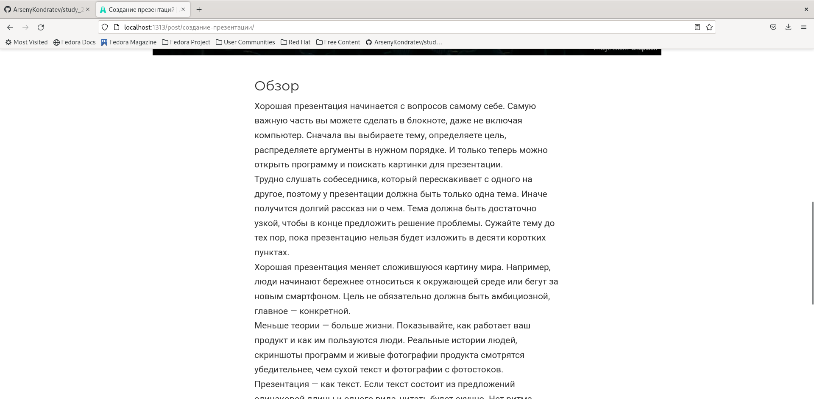

---
## Front matter
lang: ru-RU
title: "Индивидуальный проект. Шаг 4"
subtitle: "Дисциплина: Операционные системы"
author: Кондратьев Арсений Вячеславович
institute: Российский университет дружбы народов, Москва, Россия
date: 29.09.2022

## i18n babel
babel-lang: russian
babel-otherlangs: english

## Formatting pdf
toc: false
toc-title: Содержание
slide_level: 2
aspectratio: 169
section-titles: true
theme: metropolis
header-includes:
 - \metroset{progressbar=frametitle,sectionpage=progressbar,numbering=fraction}
 - '\makeatletter'
 - '\beamer@ignorenonframefalse'
 - '\makeatother'
---

# Цель работы

Добавить к сайту ссылки на научные и библиометрические ресурсы

# Выполнение лабораторной работы

1.	Зарегистрировался на соответствующих ресурсах и разместил на них ссылки на сайте(рис.[-@fig:001])

{ #fig:001 width=70% }
 
## Выполнение лабораторной работы

2. Сделал пост по прошедшей неделе(рис.[-@fig:002])

 { #fig:002 width=70% }

## Выполнение лабораторной работы

3. Добавил пост на тему создания презентаций(рис.[-@fig:003])  

{ #fig:003 width=70% }

# Выводы

Я добавил к сайту ссылки на научные и библиометрические ресурсы

