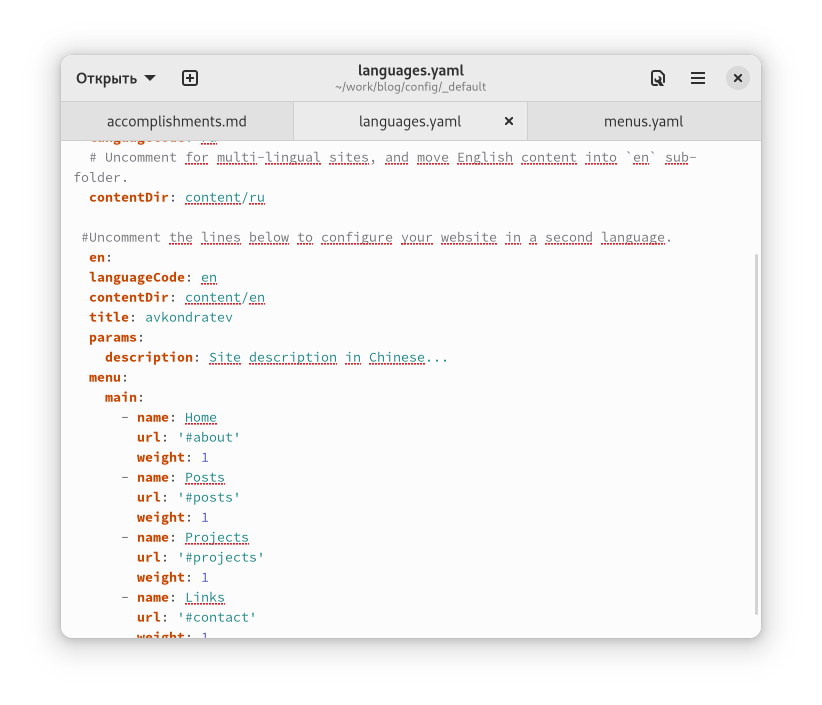
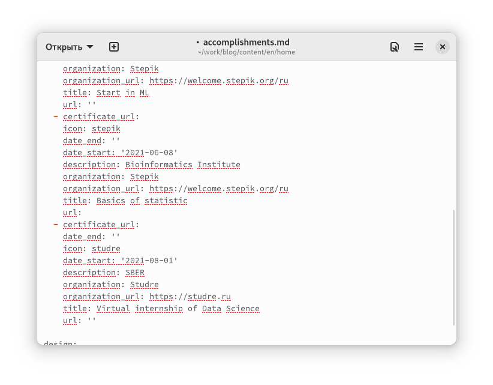
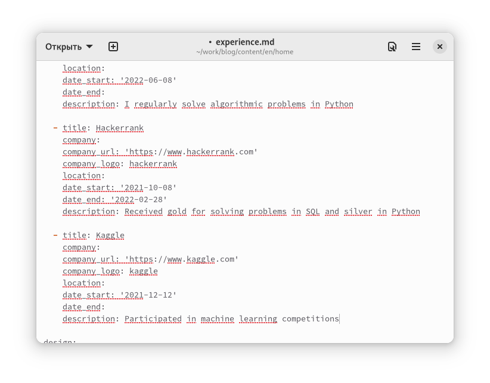
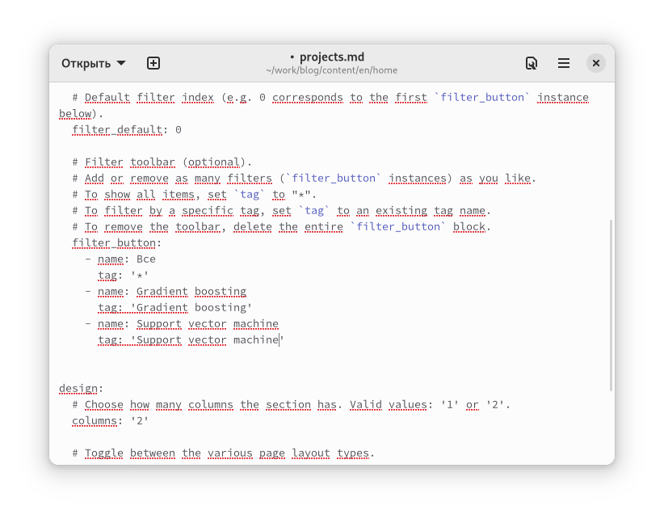
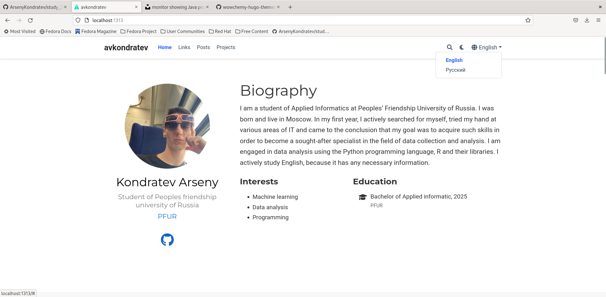
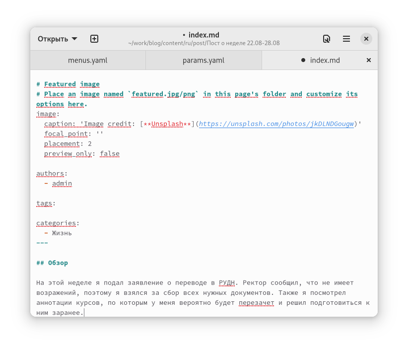

---
## Front matter
lang: ru-RU
title: "Индивидуальный проект. Шаг 6"
subtitle: "Дисциплина: Операционные системы"
author: Кондратьев Арсений Вячеславович
institute: Российский университет дружбы народов, Москва, Россия
date: 29.09.2022

## i18n babel
babel-lang: russian
babel-otherlangs: english

## Formatting pdf
toc: false
toc-title: Содержание
slide_level: 2
aspectratio: 169
section-titles: true
theme: metropolis
header-includes:
 - \metroset{progressbar=frametitle,sectionpage=progressbar,numbering=fraction}
 - '\makeatletter'
 - '\beamer@ignorenonframefalse'
 - '\makeatother'
---

# Цель работы

Размещение двуязычного сайта на Github

# Выполнение лабораторной работы

1.	Сделал поддержку английского и русского языков

Добавил поддержку двух языков в файле languages.yaml(рис.[-@fig:002])
 
{ #fig:002 width=40% }
 
2. Разместил элементы сайта на обоих языках(рис.[-@fig:003])

{ #fig:003 width=70% }

## Выполнение лабораторной работы

Изменил информацию обо мне(рис.[-@fig:004])

 { #fig:004 width=40% }
 
## Выполнение лабораторной работы
 
 Изменил информацию об опыте(рис.[-@fig:005])
 
 { #fig:005 width=40% }
 
## Выполнение лабораторной работы

 Изменил информацию о проектах(рис.[-@fig:006])
 
 { #fig:006 width=40% }
 
## Выполнение лабораторной работы
 
 { #fig:007 width=40% }
 
## Выполнение лабораторной работы
 
3. Сделал пост о прошедшей неделе(рис.[-@fig:008])  

{ #fig:008 width=40% }

## Выполнение лабораторной работы

4. Сделал пост о создании сайта на двух языках(рис.[-@fig:009]) и (рис.[-@fig:010])

На английском

{ #fig:009 width=40% }

## Выполнение лабораторной работы
На русском

{ #fig:010 width=40% }

# Выводы

Я разместил двуязычный сайт на Github

