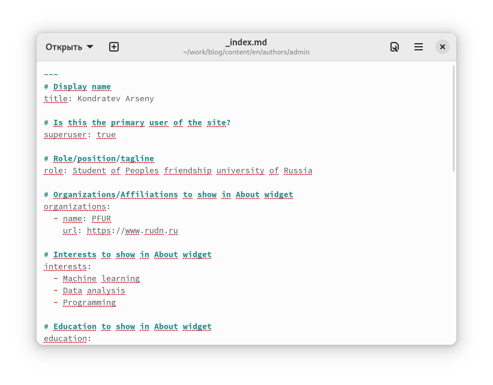
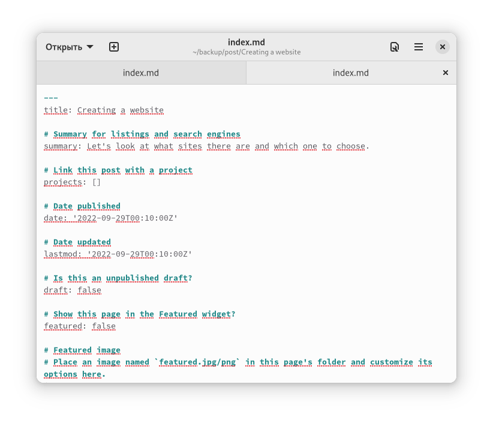
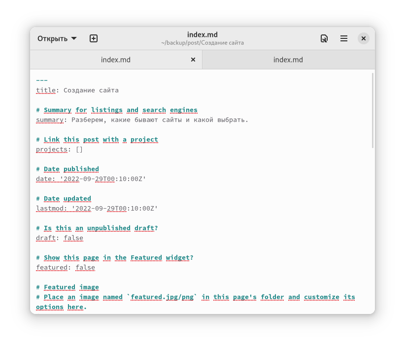

---
## Front matter
lang: ru-RU
title: "Индивидуальный проект. Шаг 6"
subtitle: "Дисциплина: Операционные системы"
author: "Кондратьев Арсений Вячеславович"
institute: "Российский университет дружбы народов, Москва, Россия"
date: 29.09.2022

## Generic otions
lang: ru-RU
toc-title: "Содержание"

## Bibliography
bibliography: bib/cite.bib
csl: pandoc/csl/gost-r-7-0-5-2008-numeric.csl

## Pdf output format
toc: true # Table of contents
toc-depth: 2

fontsize: 12pt
linestretch: 1.5
papersize: a4
documentclass: scrreprt
## I18n polyglossia
polyglossia-lang:
  name: russian
  options:
	- spelling=modern
	- babelshorthands=true
polyglossia-otherlangs:
  name: english
## I18n babel
babel-lang: russian
babel-otherlangs: english
## Fonts
mainfont: PT Serif
romanfont: PT Serif
sansfont: PT Sans
monofont: PT Mono
mainfontoptions: Ligatures=TeX
romanfontoptions: Ligatures=TeX
sansfontoptions: Ligatures=TeX,Scale=MatchLowercase
monofontoptions: Scale=MatchLowercase,Scale=0.9
## Biblatex
biblatex: true
biblio-style: "gost-numeric"
biblatexoptions:
  - parentracker=true
  - backend=biber
  - hyperref=auto
  - language=auto
  - autolang=other*
  - citestyle=gost-numeric

## Misc options
indent: true
header-includes:
  - \usepackage{indentfirst}
  - \usepackage{float} # keep figures where there are in the text
  - \floatplacement{figure}{H} # keep figures where there are in the text
---

# Цель работы

Размещение двуязычного сайта на Github

# Выполнение лабораторной работы

1.	Сделал поддержку английского и русского языков

Создал 2 каталога в content(рис.[-@fig:001])

{ #fig:001 width=70% }

Добавил поддержку двух языков в файле languages.yaml(рис.[-@fig:002])
 
{ #fig:002 width=70% }
 
2. Разместил элементы сайта на обоих языках(рис.[-@fig:003])

{ #fig:003 width=70% }

Изменил информацию обо мне(рис.[-@fig:004])

 { #fig:004 width=70% }
 
 Изменил информацию об опыте(рис.[-@fig:005])
 
 { #fig:005 width=70% }
 
 Изменил информацию о проектах(рис.[-@fig:006])
 
 { #fig:006 width=70% }
 
 { #fig:007 width=70% }
 
3. Сделал пост о прошедшей неделе(рис.[-@fig:008])  

{ #fig:008 width=70% }

4. Сделал пост о создании сайта на двух языках(рис.[-@fig:009]) и (рис.[-@fig:010])

{ #fig:009 width=70% }

{ #fig:010 width=70% }

# Выводы

Я разместил двуязычный сайт на Github

::: {#refs}
:::
